```{r setup, include=FALSE}
options(htmltools.dir.version = FALSE)
knitr::opts_chunk$set(echo=F,
                      message=F,
                      warning=F)
library(tidyverse)
set.seed(256)
update_geom_defaults("label", list(family = "Fira Sans Condensed"))
```

class: inverse

# Outline

## [Why Trade Matters](#3)
## [About This Course](#35)

---

class: inverse, center, middle

# Why Trade Matters

---

# The Importance of International Trade

.pull-left[

- In 2008, the world produced about $50 trillion (at current prices)
- $16 trillion (about 30%) was sold across national borders 

]

.pull-right[
.center[

]

]

.source[Krugman, Paul, Maurice Obstfeld, and Mark Melitz, 2011, *International Economics: Theory & Policy*, 9th ed., p.10]
---

# The Importance of International Trade

.center[
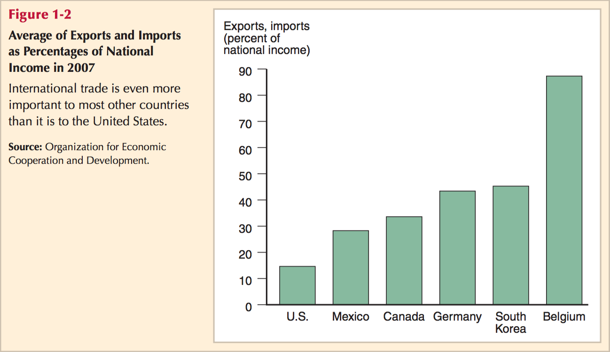
]


.source[Krugman, Paul, Maurice Obstfeld, and Mark Melitz, 2011, *International Economics: Theory & Policy*, 9^th^ ed., p.3]

---

# What Gets Traded Internationally

.center[
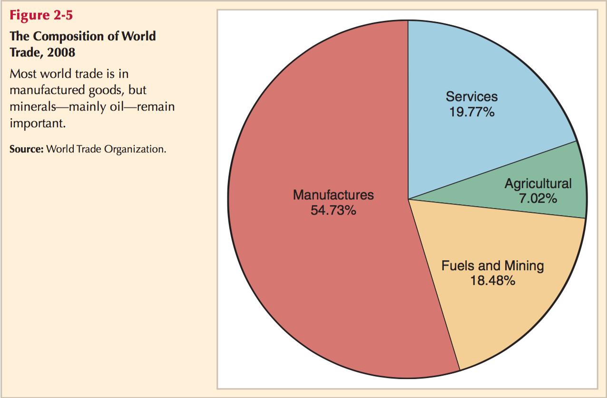
]
.source[Krugman, Paul, Maurice Obstfeld, and Mark Melitz, 2011, *International Economics: Theory & Policy*, 9^th^ ed., p.18]

---

# Who *We* Trade With

.center[
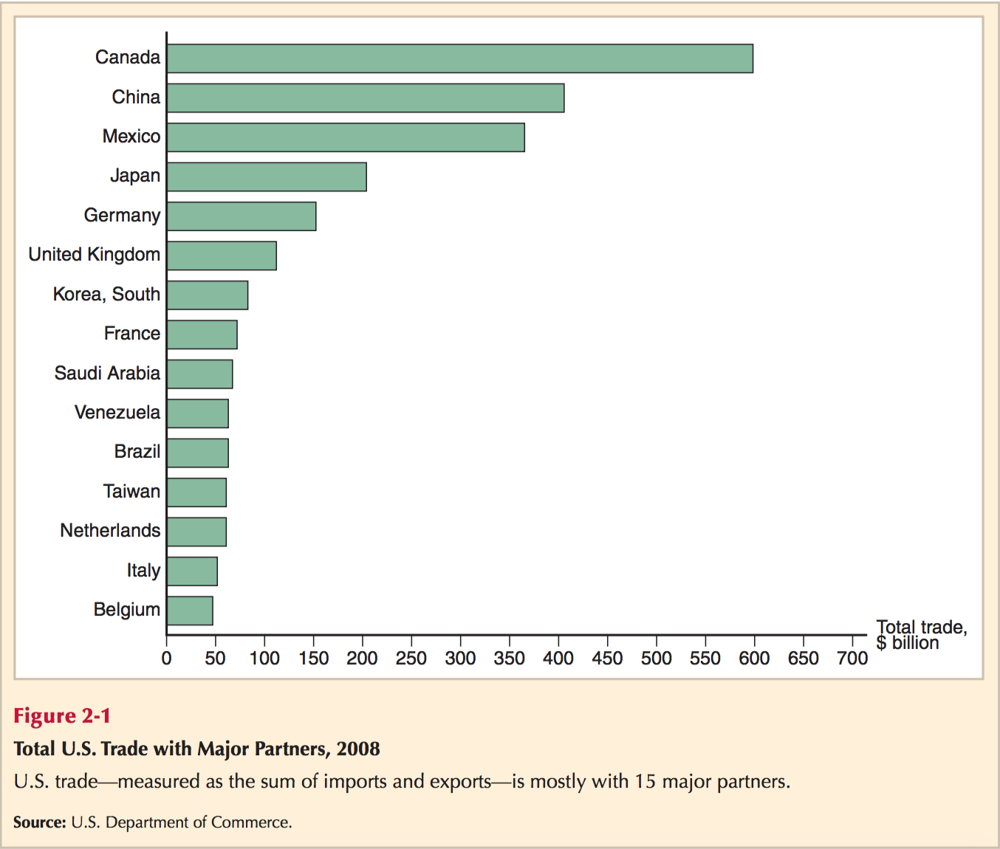
]
.source[Krugman, Paul, Maurice Obstfeld, and Mark Melitz, 2011, *International Economics: Theory & Policy*, 9^th^ ed., p.11]

---

# What We *Export*

.center[
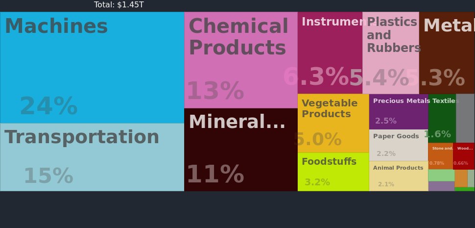
]
.source[U.S. Exports: [MIT Observatory of Economic Complexity](http://atlas.media.mit.edu/en/profile/country/usa/)]

---

# What We *Import*

.center[

]
.source[U.S. Imports: [MIT Observatory of Economic Complexity](http://atlas.media.mit.edu/en/profile/country/usa/)]

---

# Who We Trade With (Exports) Has Changed

<iframe src="https://ourworldindata.org/grapher/merchandise-exports-by-continent?stackMode=relative&country=~USA" loading="lazy" style="width: 100%; height: 500px; border: 0px none;"></iframe>

---

# A Major Change in Trading Climate

.center[
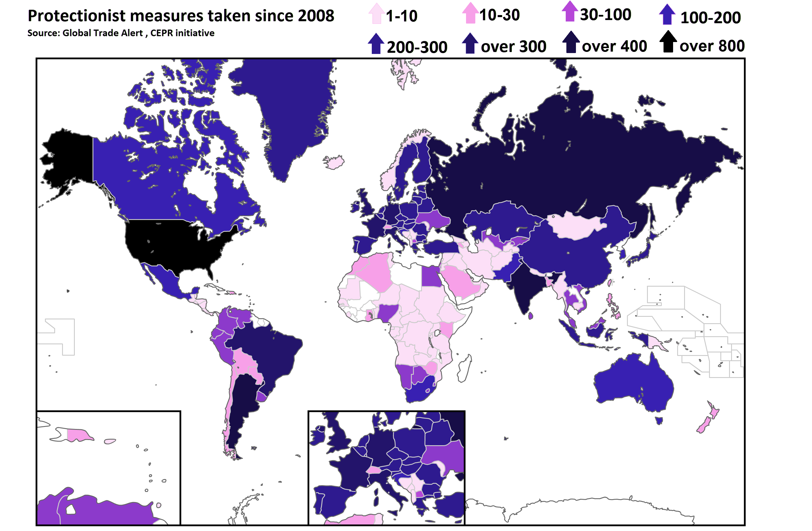
]

---

# But That's Happened Before (Often Because of War)

.center[

]

---

# The Value of International Trade in the Global Economy

<iframe src="https://ourworldindata.org/grapher/merchandise-exports-gdp-cepii?country=~OWID_WRL" loading="lazy" style="width: 100%; height: 500px; border: 0px none;"></iframe>

---

# Common Biases Against Trade

.center[
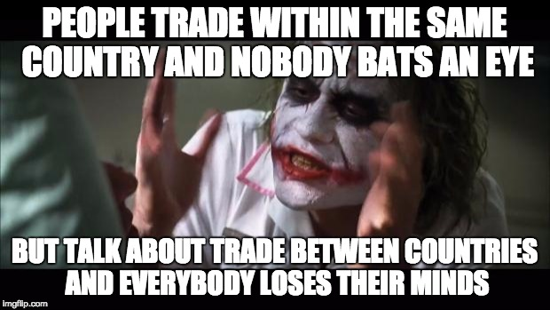
]

---

class: inverse, center, middle

# Why Care About Trade?

---

# The “Great Fact”

<iframe src="https://ourworldindata.org/grapher/maddison-data-gdp-per-capita-in-2011us-single-benchmark" loading="lazy" style="width: 100%; height: 500px; border: 0px none;"></iframe>

.source[Source: [Our World in Data: Economic Growth](https://ourworldindata.org/economic-growth)]

---

# The “Great Fact”

<iframe src="https://ourworldindata.org/grapher/average-real-gdp-per-capita-across-countries-and-regions" loading="lazy" style="width: 100%; height: 500px; border: 0px none;"></iframe>

.source[Source: [Our World in Data: Economic Growth](https://ourworldindata.org/economic-growth)]

---

# Self-Sufficiency...and Poverty 

.center[

]

---

# Where We ALL Began

.left-column[
.center[


Dierdre N. McCloskey

1942-
]
]

.right-column[
.smallest[

Two centuries ago the world’s economy stood at the present level of Chad or Bangladesh. In those good old days of 1800...the average human consumed in modern-day prices...roughly $3 a day, give or take a dollar or two...The only people much better off than the $3 average were lords or bishops or some few of the merchants. It had been this way for all of history, and for that matter all of pre-history. With her $3, the typical denizen of the earth could eat a few pounds of potatoes, a little milk, very occasionally a scrap of meat. A wool shawl. A year or two of elementary education, if exceptionally lucky. At birth she had a 50-50 chance of dying before she was 30 years old. Perhaps she was a cheerful sort, and was "happy" with illiteracy, disease, superstition, periodic starvation, and lack of prospects. After all, she had her family and faith and community, which interfered with every choice she made. But anyway she was desperately poor, and narrowly limited in human scope. (pp. 11-12)

]
]

.source[McCloskey, Diedre N, 2010, *The Bourgeois Dignity: Why Economics Can't Explain the Modern World*]

---

# Complete Interdependence...and Prosperity 

.center[

]

---

# We've Come SO Far


.left-column[
.center[


Dierdre N. McCloskey

1942-
]
]

.right-column[

.smallest[
> [Today] the world supports more than six-and-a-half times more people...the average person today earns and consumes almost ten times more goods and services than in 1800. Real income per person in the world has recently been doubling every generation, and is accelerating. Starvation worldwide therefore is at an all-time low, and falling. Literacy and life expectancy are at all-time highs, and rising. Liberty is spreading. Slavery is retreating, as is a patriarchy enslaving of women. In the richer countries, such as Norway, the average person earns fully 45 times more than in 1800, a startling $137 a day. The environment - a concern of a well-to-do bourgeoisie - is in such rich places improving. (pp. 11-12)

]

]
.source[McCloskey, Diedre N, 2010, *The Bourgeois Dignity: Why Economics Can't Explain the Modern World*, Chicago IL: University of Chicago Press]

---

# Interdependence

.left-column[
.center[


Adam Smith

1723-1790
]
]

.right-column[

> “In civilized society [man] stands at all times in need of the cooperation and assistance of great multitudes, while his whole life is scarce sufficient to gain the friendship of a few persons...man has almost constant occasion for the help of his brethren, and it is in vain for him to expect it from their benevolence only,” (Book I, Chapter 2.2)
]

.source[Smith, Adam, 1776, [*An Enquiry into the Nature and Causes of the Wealth of Nations*](https://www.econlib.org/library/Smith/smWN.html)]

---

# Our Confined Generosity

.left-column[
.center[


David Hume

1711-1776
]
]

.right-column[

> “Men being naturally selfish, or endowed only with a confined generosity, they are not easily induced to perform any action for the interest of strangers, except with a view to some reciprocal advantage, which they had no hope of obtaining but by such a performance,” (Book III, Part II, $\S$ V)
]

.source[Hume, David, 1740, *A Treatise on Human Nature*]

---

# Specialization and Exchange

.left-column[
.center[


Adam Smith

1723-1790
]
]

.right-column[

> “Whoever offers to another a bargain of any kind, proposes to do this. .hi[Give me that which I want, and you shall have this which you want]...and it is in this manner that we obtain from one another the far greater part of those good offices which we stand in need of. .hi[It is not from the benevolence of the butcher, the brewer, or the baker, that we expect our dinner, but from their regard to their own interest.],” (Book I, Chapter 2.2)
]

.source[Smith, Adam, 1776, [*An Enquiry into the Nature and Causes of the Wealth of Nations*](https://www.econlib.org/library/Smith/smWN.html)]

---

# Specialization and Exchange

.left-column[
.center[


Adam Smith

1723-1790
]
]

.right-column[

> “[Though] he intends only his own gain, and he is in this, as in many other cases, .hi[led by an invisible hand to promote an end which was no part of his intention]....hi[By pursuing his own interest he frequently promotes that of the society more effectually than when he really intends to promote it],” (Book IV, Chapter 2.9)
]

.source[Smith, Adam, 1776, [*An Enquiry into the Nature and Causes of the Wealth of Nations*](https://www.econlib.org/library/Smith/smWN.html)]

---

# How to Get Rich or Die Tryin

For 1,000s of years, .hi-purple[the elite] could only become wealthy by .hi[tribute & plunder]

.pull-left[
.center[

]
]

.pull-right[
.center[
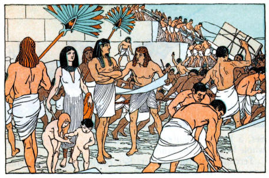
]
]

---

# How to Get Rich or Die Tryin

But in the last 300 years, .hi-purple[average people] can become wealthy by .hi[specialization & trade]

.pull-left[
.center[
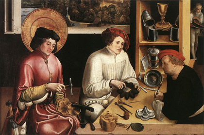
]
]

.pull-right[
.center[
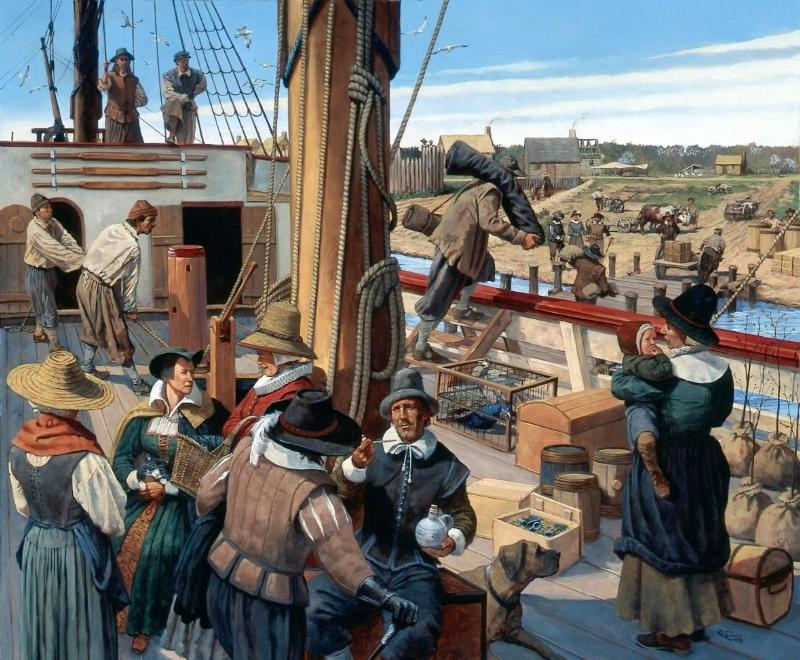
]
]

---

# Trade is The Path to Prosperity

<iframe src="https://ourworldindata.org/grapher/growth-of-income-and-trade" loading="lazy" style="width: 100%; height: 500px; border: 0px none;"></iframe>

---

# Interdependence, “Globalization,” and Trade

.pull-left[
- Human society is the result of cooperation & interdependence

- Cooperation through exchange is more prevalent than competition

- Trade within and between societies has been the lifeblood of civilizations
   - goods, services, people, capital, ideas, ideologies, religions, technologies, peace

- “Globalization” is not a new idea
]

.pull-right[
.center[
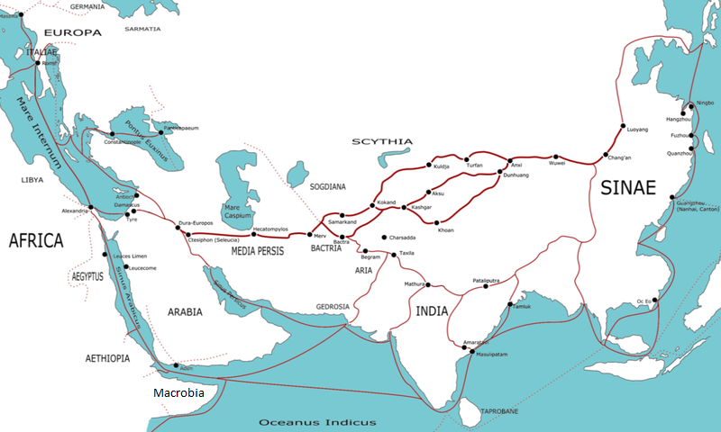
]
]

---

# “Globalization”

<iframe src="https://ourworldindata.org/grapher/globalization-over-5-centuries-km" loading="lazy" style="width: 100%; height: 500px; border: 0px none;"></iframe>

---

# Global Supply Chains

--

.pull-left[
.center[

]
]

--

.pull-right[
.center[
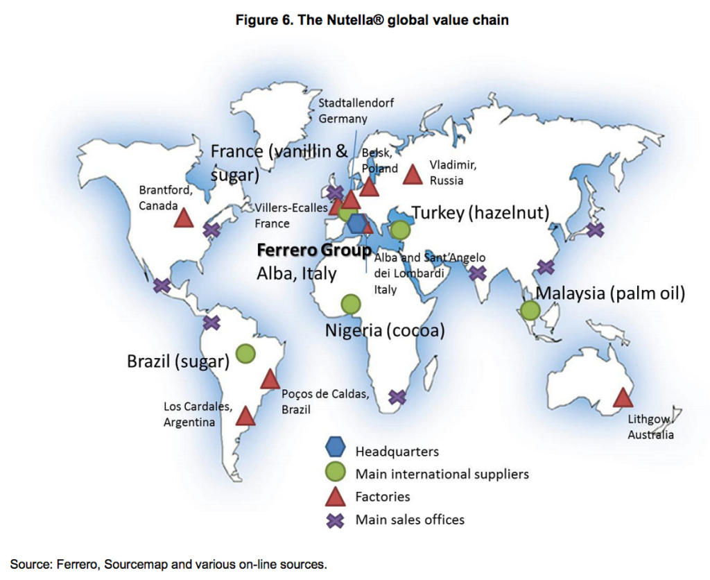
]
]

---

# Trade Today

<iframe src="https://www.shipmap.org" style="width: 100%; height: 500px; border: 0" frameborder="0"></iframe><div style="width: 100%; font-size: 10px; margin-top: 4px">Created by <a target="_top" href="https://www.kiln.digital/">London-based data visualisation studio Kiln</a> and the <a target="_top" href="http://www.bartlett.ucl.ac.uk/energy">UCL Energy Institute</a></div>

---

class: inverse, center, middle

# About This Course

---

# Logistics: Hybrid Course

.smaller[
- .hi[hybrid]: more .hi-purple[synchronous] material than .hi-turquoise[asynchronous] material

- I will always be teaching .hi[remotely]
  - A classroom is available to you
  - I may make occasional visits to campus if you *need* something in person (TBD)

- Office hours: Tu/Th 3:30-5:00 PM on Zoom
  - <i class="fas fa-video"></i> Zoom link in Blackboard's `LIVE CLASS SESSIONS` link
  - <i class="fab fa-slack"></i> Slack channels

- Teaching Assistant(s): TBD
  - grade HWs & hold (likely virtual) office hours
]

---

# Logistics: Hybrid Course

- We will have .hi-purple[synchronous] sessions Tu/Th 2:00-3:15 PM on **<i class="fas fa-video"></i> Zoom**

- Lecture videos will be posted on **Blackboard** via Panopto for students unable to join synchronously
  - If you were present, you do not need to watch the video (again)!
  - You are not *required* to attend synchronously, but it will help you

- All graded assignments are .hi-turquoise[asynchronous]
  - (Probably) submitted on Blackboard by 11:59 PM Sundays
  - (Probably) timed exams on Blackboard

---

# Learning Goals

By the end of this course, you will: 

1. articulate basic models of *why* and *what* countries trade
2. understand the political economy that determine a country's trade policies
3. intelligently comment on trade-related current events
4. present an analysis of a country's trade policy

---

# Assignments

```{r}
assignments <- tribble(
  ~Frequency,  ~Assignment, ~Weight,
  "-", "Participation", "20%",
  "n", "Homeworks", "20% (using average HW grade)",
  "1", "Country Profile", "10%",
  "1", "Midterm Exam", "25%",
  "1", "Final Exam", "25%"
)

knitr::kable(assignments, "html")
```

---

# Your Textbook (Optional but Recommended)

.center[
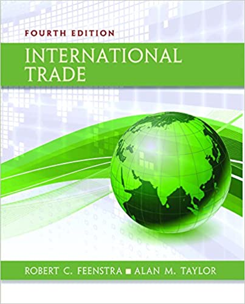
]

---

# Course Website

.pull-left[
.center[


]
]

.pull-right[
.center[
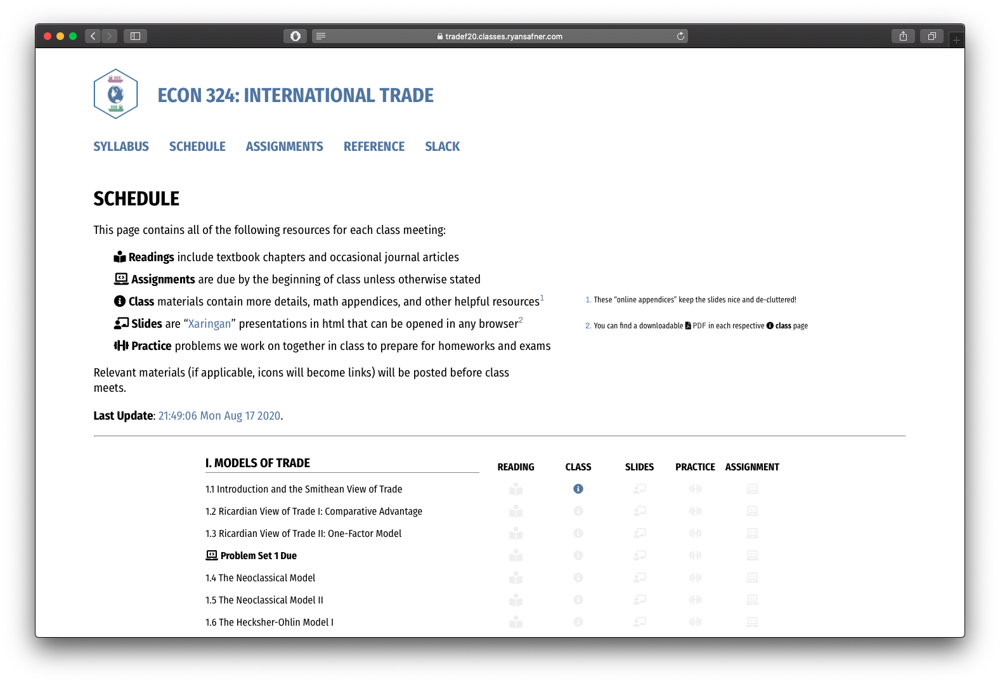
]
]

.center[
[tradeF20.classes.ryansafner.com](https://tradeF20.classes.ryansafner.com)
]

---

# Tips for Success, Or: How to College

.pull-left[
- Take notes. On paper. Really.

- Read the readings.

- Ask questions, come to office hours. Don’t struggle in silence, you are not alone!

- You are learning how to learn

- See the [reference page](http://tradeF20.classes.ryansafner.com/reference) for more
]

.pull-right[
.center[

]
]

---

# Roadmap for the Semester

.center[
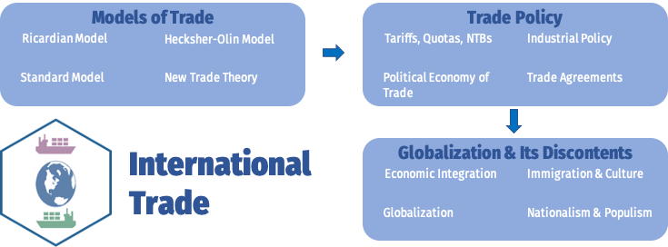
]
