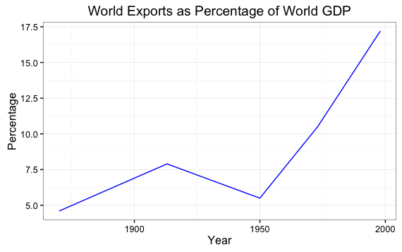
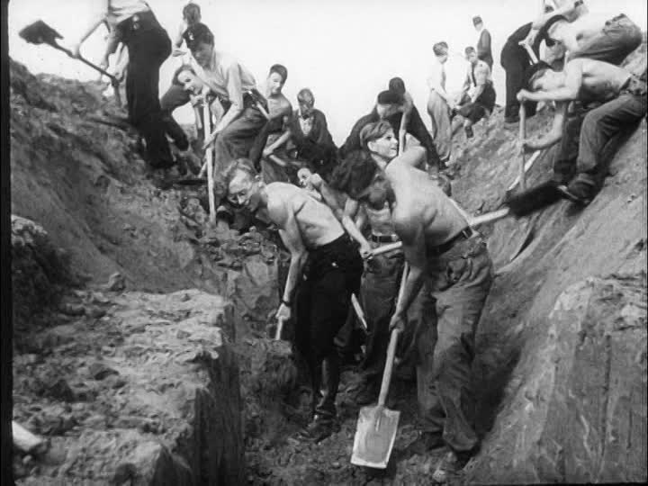
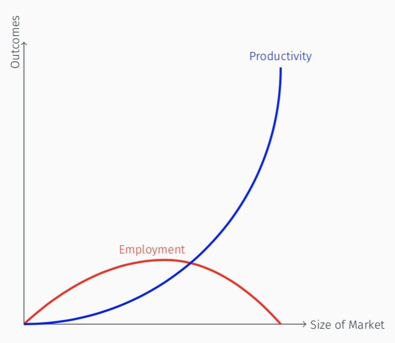
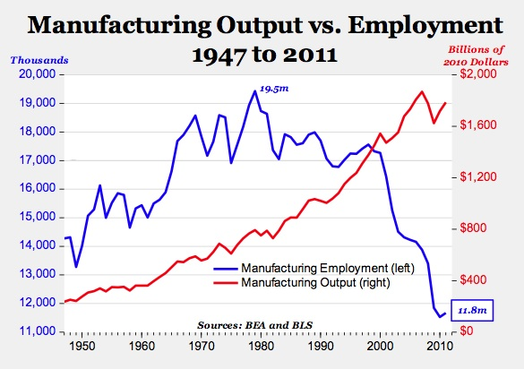

```{r setup, include=FALSE}
options(htmltools.dir.version = FALSE)
knitr::opts_chunk$set(echo=F,
                      message=F,
                      warning=F)
library(tidyverse)
set.seed(256)
update_geom_defaults("label", list(family = "Fira Sans Condensed"))
```

class: inverse

### [Overview](#)


---

class: inverse, center, middle

# The Importance of International Trade

---

# The Importance of International Trade

.pull-left[

- In 2008, the world produced about $50 trillion (at current prices)
- $16 trillion (about 30%) was sold across national borders 

]

.pull-right[
.center[

]

]

.source[Krugman, Paul, Maurice Obstfeld, and Mark Melitz, 2011, *International Economics: Theory & Policy*, 9^th^ ed., p.10]
---

# The Importance of International Trade

.center[

]


.source[Krugman, Paul, Maurice Obstfeld, and Mark Melitz, 2011, *International Economics: Theory & Policy*, 9^th^ ed., p.3]

---

# The Importance of International Trade

.center[

]


.source[Angus Maddison, The World Economy: A Millennial Perspective, World Bank, 2001, Table 3-2b.]

---

# What Gets Traded Internationally

.center[

]
.source[Krugman, Paul, Maurice Obstfeld, and Mark Melitz, 2011, *International Economics: Theory & Policy*, 9^th^ ed., p.18]

---

# Who *We* Trade With

.center[

]
.source[Krugman, Paul, Maurice Obstfeld, and Mark Melitz, 2011, *International Economics: Theory & Policy*, 9^th^ ed., p.11]

---

# What We *Export*

.center[

]
.source[U.S. Exports: [MIT Observatory of Economic Complexity](http://atlas.media.mit.edu/en/profile/country/usa/)]

---

# What We *Import*

.center[

]
.source[U.S. Imports: [MIT Observatory of Economic Complexity](http://atlas.media.mit.edu/en/profile/country/usa/)]

---

# A Major Change in Trading Climate

.center[

]

---

# Common Biases Against Trade

.center[

]

---

class: inverse, center, middle

# Why Care About Trade?

---

# The “Great Fact”

<iframe src="https://ourworldindata.org/grapher/maddison-data-gdp-per-capita-in-2011us-single-benchmark" loading="lazy" style="width: 100%; height: 600px; border: 0px none;"></iframe>

.source[Source: [Our World in Data: Economic Growth](https://ourworldindata.org/economic-growth)]

---

# The “Great Fact”

<iframe src="https://ourworldindata.org/grapher/average-real-gdp-per-capita-across-countries-and-regions" loading="lazy" style="width: 100%; height: 600px; border: 0px none;"></iframe>

.source[Source: [Our World in Data: Economic Growth](https://ourworldindata.org/economic-growth)]

---

# Self-Sufficiency...and Poverty 

.center[

]

---

# Where We ALL Began

.left-column[
.center[


Dierdre N. McCloskey

1942-
]
]

.right-column[

Two centuries ago the world’s economy stood at the present level of Chad or Bangladesh. In those good old days of 1800...the average human consumed in modern-day prices...roughly $3 a day, give or take a dollar or two...The only people much better off than the $3 average were lords or bishops or some few of the merchants. It had been this way for all of history, and for that matter all of pre-history. With her $3, the typical denizen of the earth could eat a few pounds of potatoes, a little milk, very occasionally a scrap of meat. A wool shawl. A year or two of elementary education, if exceptionally lucky. At birth she had a 50-50 chance of dying before she was 30 years old. Perhaps she was a cheerful sort, and was "happy" with illiteracy, disease, superstition, periodic starvation, and lack of prospects. After all, she had her family and faith and community, which interfered with every choice she made. But anyway she was desperately poor, and narrowly limited in human scope. (pp. 11-12)

]

.source[McCloskey, Diedre N, 2010, *The Bourgeois Dignity: Why Economics Can't Explain the Modern World*, Chicago IL: University of Chicago Press]

---

# Complete Interdependence...and Unparalleled Prosperity 

.center[

]

---

# We've Come SO Far


.left-column[
.center[


Dierdre N. McCloskey

1942-
]
]

.right-column[

> [Today] the world supports more than six-and-a-half times more people...the average person today earns and consumes almost ten times more goods and services than in 1800. Real income per person in the world has recently been doubling every generation, and is accelerating. Starvation worldwide therefore is at an all-time low, and falling. Literacy and life expectancy are at all-time highs, and rising. Liberty is spreading. Slavery is retreating, as is a patriarchy enslaving of women. In the richer countries, such as Norway, the average person earns fully 45 times more than in 1800, a startling $137 a day. The environment - a concern of a well-to-do bourgeoisie - is in such rich places improving. (pp. 11-12)
]

.source[McCloskey, Diedre N, 2010, *The Bourgeois Dignity: Why Economics Can't Explain the Modern World*, Chicago IL: University of Chicago Press]

---

# Interdependence

.left-column[
.center[


Adam Smith

1723-1790
]
]

.right-column[

> “In civilized society [man] stands at all times in need of the cooperation and assistance of great multitudes, while his whole life is scarce sufficient to gain the friendship of a few persons...man has almost constant occasion for the help of his brethren, and it is in vain for him to expect it from their benevolence only,” (Book I, Chapter 2.2)
]

.source[Smith, Adam, 1776, [*An Enquiry into the Nature and Causes of the Wealth of Nations*](https://www.econlib.org/library/Smith/smWN.html)]

---

# Our Confined Generosity

.left-column[
.center[


Adam Smith

1723-1790
]
]

.right-column[

> “Men being naturally selfish, or endowed only with a confined generosity, they are not easily induced to perform any action for the interest of strangers, except with a view to some reciprocal advantage, which they had no hope of obtaining but by such a performance,” (Book III, Part II, \S V)
]

.source[Hume, David, 1740, *A Treatise on Human Nature*

---

# Specialization and Exchange

.left-column[
.center[


Adam Smith

1723-1790
]
]

.right-column[

> “Whoever offers to another a bargain of any kind, proposes to do this. .hi[Give me that which I want, and you shall have this which you want]...and it is in this manner that we obtain from one another the far greater part of those good offices which we stand in need of. .hi[It is not from the benevolence of the butcher, the brewer, or the baker, that we expect our dinner, but from their regard to their own interest.],” (Book I, Chapter 2.2)
]

.source[Smith, Adam, 1776, [*An Enquiry into the Nature and Causes of the Wealth of Nations*](https://www.econlib.org/library/Smith/smWN.html)]

---

# Specialization and Exchange

.left-column[
.center[


Adam Smith

1723-1790
]
]

.right-column[

> “[Though] he intends only his own gain, and he is in this, as in many other cases, .hi[led by an invisible hand to promote an end which was no part of his intention]....hi[By pursuing his own interest he frequently promotes that of the society more effectually than when he really intends to promote it],” (Book IV, Chapter 2.9)
]

.source[Smith, Adam, 1776, [*An Enquiry into the Nature and Causes of the Wealth of Nations*](https://www.econlib.org/library/Smith/smWN.html)]

---

# How to Get Rich or Die Tryin

For 1,000s of years, .hi-purple[the elite] could only become wealthy by .hi[tribute & plunder]

.pull-left[
.center[

]
]

.pull-right[
.center[

]
]

---

# How to Get Rich or Die Tryin

But in the last 300 years, .hi-purple[average people] can become wealthy by .hi[specialization & trade]

.pull-left[
.center[

]
]

.pull-right[
.center[

]
]

---

# Interdependence, “Globalization,” and Trade

.pull-left[
- Human society is the result of cooperation & interdependence

- Cooperation through exchange is more prevalent than competition

- Trade within and between societies has been the lifeblood of civilizations
   - goods, services, people, capital, ideas, ideologies, religions, technologies, peace

- “Globalization” is not a new idea
]

.pull-right[
.center[

]
]

---

# Global Supply Chains

.pull-left[
.center[

]
]

--

.pull-right[
.center[

]
]

---

class: inverse, center, middle

# Smith's View of Trade: The Division of Labor

---

# The Division of Labor I

.left-column[
.center[


Adam Smith

1723-1790
]
]

.right-column[

> "The greatest improvement in the productive powers of labour, and the greater part of the skill, dexterity, and judgment with which it is any where directed, or applied, seem to have been the effects of the **division of labour**," (Book I, Chapter 1).
]

.source[Smith, Adam, 1776, [*An Enquiry into the Nature and Causes of the Wealth of Nations*](https://www.econlib.org/library/Smith/smWN.html)]

---

# The Division of Labor II

.pull-left[
- Output performed under the .hi[division of labor] exceeds output performed in isolation (.hi-purple[autarky])

- Variation in factor endowments

- Variation in production opportunities

- Variation in human talents
]

.pull-right[


]

---

# The Division of Labor III

.left-column[
.center[


Adam Smith

1723-1790
]
]

.right-column[

> "It is but a very small part of a man's wants which the produce of his own labour can supply. He supplies the far greater part of them by exchanging that surplus part of the produce of his own labour, which is over and above his own consumption, for such parts of the produce of other men's labour as he has occasion for. Every man thus lives by exchanging, or becomes in some measure a merchant, and the society itself grows to be what is properly a commercial society," (Book I, Chapter 4).
]

.source[Smith, Adam, 1776, [*An Enquiry into the Nature and Causes of the Wealth of Nations*](https://www.econlib.org/library/Smith/smWN.html)]

---

# Smith's Pin Factory Example I

.left-column[
.center[


Adam Smith

1723-1790
]
]

.right-column[
.smallest[
> "To take an example...from a very trifling manufacture...the trade of the **pin-maker**. [I]n the way in which this business is now carried on, not only the whole work is a peculiar trade, but it is divided into a number of branches, of which the greater part are likewise peculiar trades. One man draws out the wire, another straights it, a third cuts it, a fourth points it, a fifth grinds it at the top for receiving the head...and **the important business of making a pin is, in this manner, divided into about eighteen distinct operations**...**Ten men only were employed [and they] could make among them upwards of forty-eight thousand pins in a day...But if they had all wrought separately and independently [they] certainly could not each of them have made twenty, perhaps not one pin in a day...**" (Book I, Chapter 1).

]
]
.source[Smith, Adam, 1776, [*An Enquiry into the Nature and Causes of the Wealth of Nations*](https://www.econlib.org/library/Smith/smWN.html)]

---

# Smith's Pin Factory Example II

.center[


Adam Smith's pin factory illustration
]

---

# Division of Labor: Origins

.left-column[
.center[


Adam Smith

1723-1790
]
]

.right-column[

> "This **division of labour**, from which so many advantages are derived, **is not originally the effect of any human wisdom**, which foresees and intends that general opulence to which it gives occasion. It is the necessary, though very slow and gradual, **consequence of a certain propensity in human nature** which has in view no such extensive utility; **the propensity to truck, barter, and exchange one thing for another,**" (Book I, Chapter 2).
]

.source[Smith, Adam, 1776, [*An Enquiry into the Nature and Causes of the Wealth of Nations*](https://www.econlib.org/library/Smith/smWN.html)]

---

# DOL Is Limited By the Extent of the Market

.left-column[
.center[


Adam Smith

1723-1790
]
]

.right-column[

> "As it is the power of exchanging that gives occasion to the division of labour, so **the extent of this division must always be limited by...the extent of the market.** When the market is very small, no person can have any encouragement to dedicate himself entirely to one employment, for want of the power to exchange all that surplus part of the produce of his own labour, which is over and above his own consumption, for such parts of the produce of other men's labour as he has occasion for," (Book I, Chapter 3).
]

.source[Smith, Adam, 1776, [*An Enquiry into the Nature and Causes of the Wealth of Nations*](https://www.econlib.org/library/Smith/smWN.html)]

---

# The Division of Labor: Summary

.pull-left[
.smallest[

- .hi[Division of labor]: process where people *specialize* in production and then *exchange* their produce with others to acquire all of their desired goods

- Two senses: 
    1. **Factory system**: splitting up production process into specialized discrete steps boosts productivity
    2. **Economic system**: an economy of people specialize & exchange for all needs, leading to widespread prosperity
    
- .hi-purple[The more trading opportunities, the greater the benefits of specialization]

]
]

.pull-right[
.center[

]
]

---

# The Division of Labor and Capital Accumulation I

.left-column[
.center[


Allyn Young

1876-1929
]
]

.right-column[

.smaller[

> "The important thing, of course, is that **with the division of labour a group of complex processes is transformed into a succession of simpler processes, some of which, at least, lend themselves to the use of machinery**. In the use of machinery and the adoption of indirect processes there is a further division of labour, the economies of which are again **limited by the extent of the market**. **It would be wasteful to make a hammer to drive a single nail; it would be better to use whatever awkward implement lies conveniently at hand**," (p.530).

]
]
.source[Young, Allyn, 1928, "Increasing Returns and Economics Progress," *Economic Journal* 38(152)]

---

# The Division of Labor and Capital Accumulation II

.left-column[
.center[


Allyn Young

1876-1929
]
]

.right-column[

.smaller[

> "It would be wasteful to furnish a factory with an elaborate equipment of specially constructed jigs, gauges, lathes, drills, presses and conveyors to build a hundred automobiles; it would be better to rely mostly upon tools and machines of standard types, so as to make a relatively larger use of directly applied and a relatively smaller use of indirectly-applied labour. **[Henry] Ford's methods would be absurdly uneconomical if his output were very small**, and would be unprofitable even if his output were what many other manufacturers of automobiles would call large.," (p.530).

]
]
.source[Young, Allyn, 1928, "Increasing Returns and Economics Progress," *Economic Journal* 38(152)]

---

# The Division of Labor and Capital Accumulation III

.pull-left[
.smaller[
- More trading opportunities create .hi-purple[economies of scale]
    - As $\uparrow$ output, $\downarrow$ average cost
    
- Makes large investments in capital & technology profitable
    - Spreads $f$ over a larger volume of $q$
    
- Labor-saving technologies
    - May replace labor entirely with capital
    - Might create new complex tasks for labor
]
]
.pull-right[
.center[

]
]

---

# Division of Labor and Extent of the Market

.center[

]

---

# The Division of *Knowledge*

- Greater extent of the market $\rightarrow$ greater division of labor, and also a greater specialization and .hi-purple[division of knowledge]

.center[

]

---

# The Division of *Knowledge*

- Greater extent of the market $\rightarrow$ greater division of labor, and also a greater specialization and .hi-purple[division of knowledge]

.center[


]

---

# Division of Labor, Productivity, & Employment

.left-column[
.center[


Michael Munger
]
]

.right-column[
.smaller[
> "The market Smith was talking about was the number of potential (and, in an important sense, actual!) customers for the product in question. As the ability of transport and communications to handle trade increases, the size of factories increases. Let me say that again, because it is so obvious it's confusing. .hi[As the number of potential customers you can reach expands, and the costs of shipping and handling fall, factories become fewer and larger.] There is far more capital investment in these factories, but fewer workers. And output increases ten-fold, a hundred-fold, a billion-fold."

]
]

.source[Munger, Michael, 2007, ["I'll Stick With These: Some Sharp Observations on the Division of Labor,"](https://www.econlib.org/library/Columns/y2007/Mungerpins.html) *EconLog*]

---

# Division of Labor, Productivity, & Employment: Example

.center[


100 workers with sticks
]


---

# Division of Labor, Productivity, & Employment: Example

.center[


10 workers with shovels
]


---

# Division of Labor, Productivity, & Employment: Example

.center[


1 worker with a backhoe
]


---

# Division of Labor, Productivity, & Employment: A Framework

.pull-left[
.center[

]
]

.pull-right[

- .hi-blue[Productivity Per Worker]: exponential increase with larger markets & more capital investment

- .hi-red[Employment]: Increase, then decrease, with larger markets & more capital investment

]

---

# Division of Labor, Productivity, & Employment

.left-column[
.center[


Michael Munger
]
]

.right-column[
.smaller[
> "Today, most pin manufacture has moved to Asia. Your first impulse might be to nod and think, ``Sure, cheap labor.'' But that is not an important part of the story. Pin manufacturing is highly capital intensive. Smith's insight on the division of labor, and Howe's idea of making the process continuous and making labor more productive, have combined to expand the market for Chinese pins to the whole world. The number of workers engaged in pin manufacture in China has \emph{fallen}, not risen, as pin output has expanded. And wages have increased more than ten-fold, as productivity has exploded"

]
]

.source[Munger, Michael, 2007, ["I'll Stick With These: Some Sharp Observations on the Division of Labor,"](https://www.econlib.org/library/Columns/y2007/Mungerpins.html) *EconLog*]

---

# Division of Labor, Productivity, & Employment


.center[

]

---

# Division of Labor, Productivity, & Employment


.center[

]

---

class: inverse, center, middle

# About This Course

---

# Logistics: Hybrid Course

.smaller[
- .hi[hybrid]: more .hi-purple[synchronous] material than .hi-turquoise[asynchronous] material

- I will always be teaching .hi[remotely]
  - A classroom is available to you
  - I may make occasional visits to campus if you *need* something in person (TBD)

- Office hours: Tu/Th 3:30-5:00 PM on Zoom
  - <i class="fas fa-video"></i> Zoom link in Blackboard's `LIVE CLASS SESSIONS` link
  - <i class="fab fa-slack"></i> Slack channels

- Teaching Assistant(s): TBD
  - grade HWs & hold (likely virtual) office hours
]

---

# Logistics: Hybrid Course

- We will have .hi-purple[synchronous] sessions Mon/Wed 2:00-3:15 PM on **<i class="fas fa-video"></i> Zoom**

- Lecture videos will be posted on **Blackboard** via Panopto for students unable to join synchronously
  - If you were present, you do not need to watch the video (again)!
  - You are not *required* to attend synchronously, but it will help you

- All graded assignments are .hi-turquoise[asynchronous]
  - (Probably) submitted on Blackboard by 11:59 PM Sundays
  - (Probably) timed exams on Blackboard

---

# Learning Goals

By the end of this course, you will: 

1. articulate basic models of *why* and *what* countries trade
2. understand the political economy that determine a country's trade policies
3. intelligently comment on trade-related current events
4. present an analysis of a country's trade policy

---


# Assignments

```{r}
assignments <- tribble(
  ~Frequency,  ~Assignment, ~Weight,
  "-", "Participation", "20%",
  "n", "Homeworks", "20% (using average HW grade)",
  "1", "Country Profile", "10%",
  "1", "Midterm Exam", "25%",
  "1", "Final Exam", "25%"
)

knitr::kable(assignments, "html")
```

---

# Your Textbook (Optional but Recommended)

.center[

]

---

# Course Website

.pull-left[
.center[


]
]

.pull-right[
.center[

]
]

.center[
[tradeF20.classes.ryansafner.com](https://tradeF20.classes.ryansafner.com)
]

---

# Tips for Success, Or: How to College

.pull-left[
- Take notes. On paper. Really.

- Read the readings.

- Ask questions, come to office hours. Don’t struggle in silence, you are not alone!

- You are learning how to learn

- See the [reference page](http://tradeF20.classes.ryansafner.com/reference) for more
]

.pull-right[
.center[

]
]

---

# Roadmap for the Semester

.center[

]
