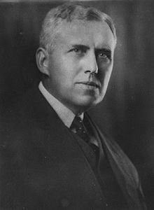
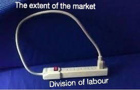
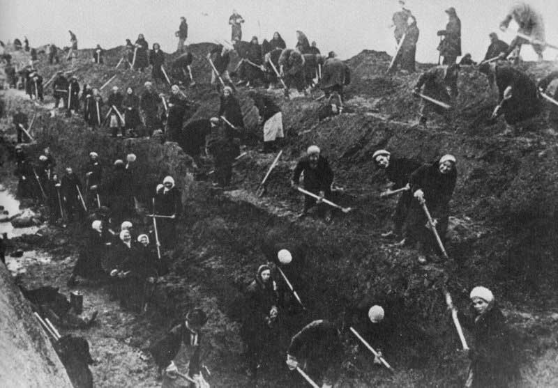
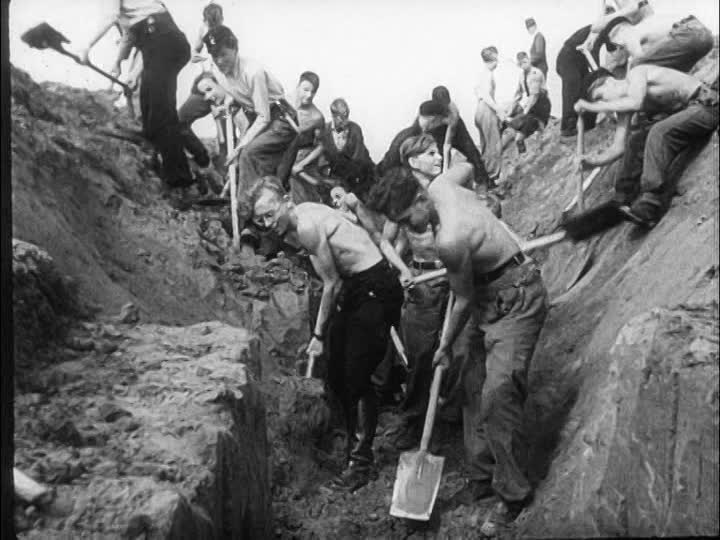
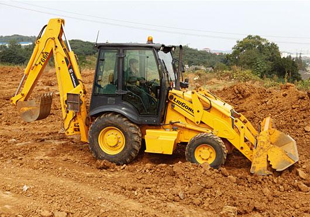
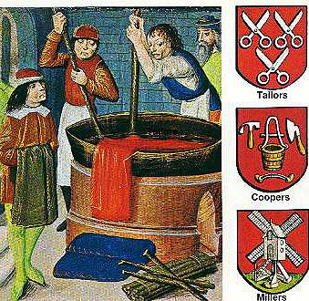
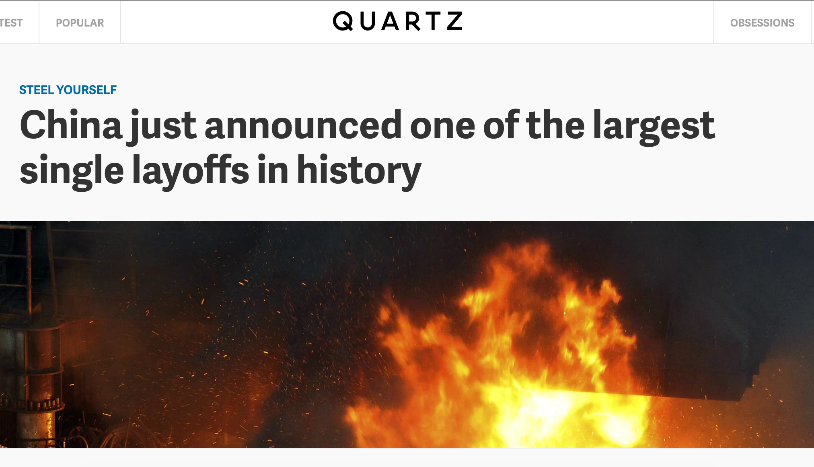
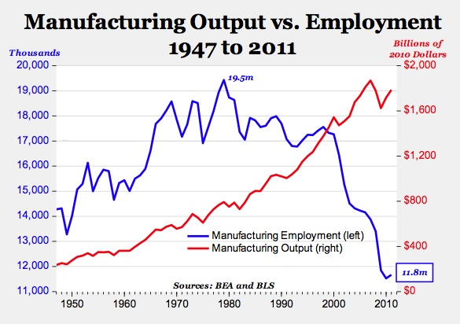
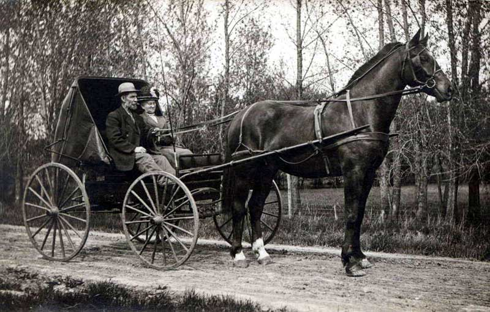
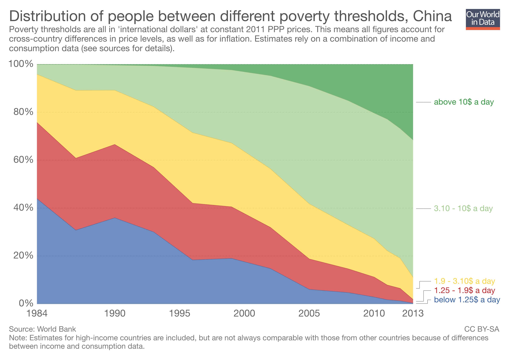

```{r setup, include=FALSE}
options(htmltools.dir.version = FALSE)
knitr::opts_chunk$set(echo=F,
                      message=F,
                      warning=F,
                      fig.retina=3)
library(tidyverse)
library(mosaic)
set.seed(256)
update_geom_defaults("label", list(family = "Fira Sans Condensed"))
```

# The Division of Labor I

.left-column[
.center[


Adam Smith

1723-1790
]
]

.right-column[

> "The greatest improvement in the productive powers of labour, and the greater part of the skill, dexterity, and judgment with which it is any where directed, or applied, seem to have been the effects of the **division of labour**," (Book I, Chapter 1).
]

.source[Smith, Adam, 1776, [*An Enquiry into the Nature and Causes of the Wealth of Nations*](https://www.econlib.org/library/Smith/smWN.html)]

---

# The Division of Labor II

.pull-left[
- Output performed under the .hi[division of labor] exceeds output performed in isolation (.hi-purple[autarky])

- Variation in factor endowments

- Variation in production opportunities

- Variation in human talents
]

.pull-right[


]

---

# The Division of Labor III

.left-column[
.center[


Adam Smith

1723-1790
]
]

.right-column[

> "It is but a very small part of a man's wants which the produce of his own labour can supply. He supplies the far greater part of them by exchanging that surplus part of the produce of his own labour, which is over and above his own consumption, for such parts of the produce of other men's labour as he has occasion for. Every man thus lives by exchanging, or becomes in some measure a merchant, and the society itself grows to be what is properly a commercial society," (Book I, Chapter 4).
]

.source[Smith, Adam, 1776, [*An Enquiry into the Nature and Causes of the Wealth of Nations*](https://www.econlib.org/library/Smith/smWN.html)]

---

# Smith's Pin Factory Example I

.left-column[
.center[


Adam Smith

1723-1790
]
]

.right-column[
.smallest[
> "To take an example...from a very trifling manufacture...the trade of the **pin-maker**. [I]n the way in which this business is now carried on, not only the whole work is a peculiar trade, but it is divided into a number of branches, of which the greater part are likewise peculiar trades. One man draws out the wire, another straights it, a third cuts it, a fourth points it, a fifth grinds it at the top for receiving the head...and **the important business of making a pin is, in this manner, divided into about eighteen distinct operations**...**Ten men only were employed [and they] could make among them upwards of forty-eight thousand pins in a day...But if they had all wrought separately and independently [they] certainly could not each of them have made twenty, perhaps not one pin in a day...**" (Book I, Chapter 1).

]
]
.source[Smith, Adam, 1776, [*An Enquiry into the Nature and Causes of the Wealth of Nations*](https://www.econlib.org/library/Smith/smWN.html)]

---

# Smith's Pin Factory Example II

.center[


Adam Smith's pin factory illustration
]

---

# Division of Labor: Origins

.left-column[
.center[


Adam Smith

1723-1790
]
]

.right-column[

> "This **division of labour**, from which so many advantages are derived, **is not originally the effect of any human wisdom**, which foresees and intends that general opulence to which it gives occasion. It is the necessary, though very slow and gradual, **consequence of a certain propensity in human nature** which has in view no such extensive utility; **the propensity to truck, barter, and exchange one thing for another,**" (Book I, Chapter 2).
]

.source[Smith, Adam, 1776, [*An Enquiry into the Nature and Causes of the Wealth of Nations*](https://www.econlib.org/library/Smith/smWN.html)]

---

# DOL Is Limited By the Extent of the Market

.left-column[
.center[


Adam Smith

1723-1790
]
]

.right-column[

> "As it is the power of exchanging that gives occasion to the division of labour, so **the extent of this division must always be limited by...the extent of the market.** When the market is very small, no person can have any encouragement to dedicate himself entirely to one employment, for want of the power to exchange all that surplus part of the produce of his own labour, which is over and above his own consumption, for such parts of the produce of other men's labour as he has occasion for," (Book I, Chapter 3).
]

.source[Smith, Adam, 1776, [*An Enquiry into the Nature and Causes of the Wealth of Nations*](https://www.econlib.org/library/Smith/smWN.html)]

---

# The Division of Labor: Summary

.pull-left[
.smallest[

- .hi[Division of labor]: process where people *specialize* in production and then *exchange* their produce with others to acquire all of their desired goods

- Two senses: 
    1. **Factory system**: splitting up production process into specialized discrete steps boosts productivity
    2. **Economic system**: an economy of people specialize & exchange for all needs, leading to widespread prosperity
    
- .hi-purple[The more trading opportunities, the greater the benefits of specialization]

]
]

.pull-right[
.center[

]
]

---

# The Division of Labor and Capital Accumulation I

.left-column[
.center[


Allyn Young

1876-1929
]
]

.right-column[

.smaller[

> "The important thing, of course, is that **with the division of labour a group of complex processes is transformed into a succession of simpler processes, some of which, at least, lend themselves to the use of machinery**. In the use of machinery and the adoption of indirect processes there is a further division of labour, the economies of which are again **limited by the extent of the market**. **It would be wasteful to make a hammer to drive a single nail; it would be better to use whatever awkward implement lies conveniently at hand**," (p.530).

]
]
.source[Young, Allyn, 1928, "Increasing Returns and Economics Progress," *Economic Journal* 38(152)]

---

# The Division of Labor and Capital Accumulation II

.left-column[
.center[


Allyn Young

1876-1929
]
]

.right-column[

.smaller[

> "It would be wasteful to furnish a factory with an elaborate equipment of specially constructed jigs, gauges, lathes, drills, presses and conveyors to build a hundred automobiles; it would be better to rely mostly upon tools and machines of standard types, so as to make a relatively larger use of directly applied and a relatively smaller use of indirectly-applied labour. **[Henry] Ford's methods would be absurdly uneconomical if his output were very small**, and would be unprofitable even if his output were what many other manufacturers of automobiles would call large.," (p.530).

]
]
.source[Young, Allyn, 1928, "Increasing Returns and Economics Progress," *Economic Journal* 38(152)]

---

# The Division of Labor and Capital Accumulation III

.pull-left[
.smaller[
- More trading opportunities create .hi-purple[economies of scale]
    - As $\uparrow$ output, $\downarrow$ average cost
    
- Makes large investments in capital & technology profitable
    - Spreads $f$ over a larger volume of $q$
    
- Labor-saving technologies
    - May replace labor entirely with capital
    - Might create new complex tasks for labor
]
]
.pull-right[
.center[

]
]

---

# Division of Labor and Extent of the Market

.center[

]

---

# The Division of *Knowledge*

- Greater extent of the market $\rightarrow$ greater division of labor, and also a greater specialization and .hi-purple[division of knowledge]

.center[

]

---

# The Division of *Knowledge*

- Greater extent of the market $\rightarrow$ greater division of labor, and also a greater specialization and .hi-purple[division of knowledge]

.center[


]

---

# Division of Labor, Productivity, & Employment

.left-column[
.center[


Michael Munger
]
]

.right-column[
.smaller[
> "The market Smith was talking about was the number of potential (and, in an important sense, actual!) customers for the product in question. As the ability of transport and communications to handle trade increases, the size of factories increases. Let me say that again, because it is so obvious it's confusing. .hi[As the number of potential customers you can reach expands, and the costs of shipping and handling fall, factories become fewer and larger.] There is far more capital investment in these factories, but fewer workers. And output increases ten-fold, a hundred-fold, a billion-fold."

]
]

.source[Munger, Michael, 2007, ["I'll Stick With These: Some Sharp Observations on the Division of Labor,"](https://www.econlib.org/library/Columns/y2007/Mungerpins.html) *EconLog*]

---

# Division of Labor, Productivity, & Employment: Example

.center[


100 workers with sticks
]


---

# Division of Labor, Productivity, & Employment: Example

.center[


10 workers with shovels
]


---

# Division of Labor, Productivity, & Employment: Example

.center[


1 worker with a backhoe
]


---

# A Framework to Think About DOL

.pull-left[
- .hi-blue[Productivity Per Worker]: exponential increase with larger markets & more capital investment

- .hi-red[Employment]: Increase, then decrease, with larger markets & more capital investment

- Not shown:
  - steady increase in .hi-green[investment, capital goods]
]

.pull-right[

```{r}
product<-function(x){2^x}
employ<-function(x){(-(x-3)^2)+10}

dol_graph<-ggplot(data = tibble(x=1:10))+
  aes(x = x)+
  stat_function(fun=product, geom="line", size=2, color = "blue")+
    geom_label(aes(x=5,y=product(5)), color = "blue", label="Productivity", size = 5)+
  stat_function(fun=employ, geom="line", size=2, color = "red")+
    geom_label(aes(x=5,y=employ(5)), color = "red", label="Employment", size = 5)+
    scale_x_continuous(breaks=NULL,
                     limits=c(0,6.25),
                     expand=expand_scale(mult=c(0,0.1)))+
  scale_y_continuous(breaks=NULL,
                     limits=c(0,55),
                     expand=expand_scale(mult=c(0,0.1)))+
  labs(x = "Extent of the Market",
       y = "Outcomes")+
  theme_classic(base_family = "Fira Sans Condensed", base_size=20)+
  theme(axis.line.x = element_line(arrow=arrow(length = unit(3, 'mm'))), 
    axis.line.y=element_line(arrow = arrow(length = unit(3, 'mm')))
  )
dol_graph
```

]

---

# A Framework to Think About DOL

.pull-left[

- *Small*-scale, *local* artisans, guilds serving only *local* community

- Most production is (agricultural) for *subsistence*, not for *exchange*

- .hi-blue[Productivity Per Worker]: very low productivity

- .hi-red[Employment]: Very few specialized workers (most are farming to survive)

]

.pull-right[

```{r}
dol_graph+
  geom_vline(xintercept = 1, size = 1, linetype = "dashed", color = "purple")+
  geom_label(x = 1, y = 50, label = "Small \n Parochial Markets", color = "purple")
```

]

---

# A Framework to Think About DOL

.pull-left[

- *Small*-scale, *local* artisans, guilds serving only *local* community

- Most production is (agricultural) for *subsistence*, not for *exchange*

- .hi-blue[Productivity Per Worker]: very low productivity

- .hi-red[Employment]: Very few specialized workers (most are farming to survive)

]

.pull-right[

.center[

]
]

---
# A Framework to Think About DOL

.pull-left[
- *Growing* firms with some *capital investment* (tools) serving *national* and *regional* markets 

- .hi-blue[Productivity Per Worker]: increase in productivity from learning by doing, specialized tools

- .hi-red[Employment]: growing, as more workers are needed to keep up with demand, incease in wages and skills

]

.pull-right[

```{r}
dol_graph+
  geom_vline(xintercept = 3, size = 1, linetype = "dashed", color = "purple")+
  geom_label(x = 3, y = 50, label = "Developing \n Regional Markets", color = "purple")
```

]

---

# A Framework to Think About DOL

.pull-left[
- Growing firms with some capital investment (tools) serving national and regional markets 

- .hi-blue[Productivity Per Worker]: increase in productivity from learning by doing, specialized tools

- .hi-red[Employment]: growing, as more workers are needed to keep up with demand, incease in wages and skills

]

.pull-right[

.center[

]
]

---

# A Framework to Think About DOL

.pull-left[
- A *small* number of *massive* firms supplying the world market

- .hi-blue[Productivity Per Worker]: massive productivity per worker

- .hi-red[Employment]: *very few*, *highly-skilled*, *highly-paid* workers
  - capital augmenting & replacing labor

]

.pull-right[

```{r}
dol_graph+
  geom_vline(xintercept = 5.5, size = 1, linetype = "dashed", color = "purple")+
  geom_label(x = 5.5, y = 55, label = "Industrialized \n Global Markets", color = "purple")
```

]

---

# A Framework to Think About DOL

.pull-left[
- A *small* number of *massive* firms supplying the world market

- .hi-blue[Productivity Per Worker]: massive productivity per worker

- .hi-red[Employment]: *very few*, *highly-skilled*, *highly-paid* workers
  - capital augmenting & replacing labor

]

.pull-right[

.center[

]
]

---

# Division of Labor, Productivity, & Employment

.left-column[
.center[


Michael Munger
]
]

.right-column[
.smaller[
> "Today, most pin manufacture has moved to Asia. Your first impulse might be to nod and think, ``Sure, cheap labor.'' But that is not an important part of the story. Pin manufacturing is highly capital intensive. Smith's insight on the division of labor, and Howe's idea of making the process continuous and making labor more productive, have combined to expand the market for Chinese pins to the whole world. The number of workers engaged in pin manufacture in China has \emph{fallen}, not risen, as pin output has expanded. And wages have increased more than ten-fold, as productivity has exploded"

]
]

.source[Munger, Michael, 2007, ["I'll Stick With These: Some Sharp Observations on the Division of Labor,"](https://www.econlib.org/library/Columns/y2007/Mungerpins.html) *EconLog*]

---

# Division of Labor, Productivity, & Employment

.center[

]

---

# The Effects of the Division of Labor

.center[

]

---

# The Effects of the Division of Labor

.pull-left[

| Year | U.S. Population | % working on farms |
|------|----------------:|-------------------:|
| 1790 | 4,000,000       | 90% |

]

.pull-right[
.center[

]
]

---

# The Effects of the Division of Labor

.pull-left[

| Year | U.S. Population | % working on farms |
|------|----------------:|-------------------:|
| 1790 | 4,000,000       | 90% |
| 1900 | 76,000,000      | 40% |
]

.pull-right[
.center[

]
]

---

# The Effects of the Division of Labor

.pull-left[

| Year | U.S. Population | % working on farms |
|------|----------------:|-------------------:|
| 1790 | 4,000,000       | 90% |
| 1900 | 76,000,000      | 40% |
| 2015 | 326,000,000     | <1% |

.source[Source: [U.S. Department of Agriculture Economic Research Service](https://www.ers.usda.gov/topics/farm-economy/farm-labor/)]
]

.pull-right[
.center[

]
]

---

# Markets as an Evolutionary Process

.left-column[
.center[


Joseph Schumpeter

1883-1950
]
]

.right-column[
.smallest[
> "Capitalism...is by nature a form of economic change and not only never is but never can be stationary...The essential point to grasp is that in dealing with capitalism we are dealing with an .hi[evolutionary process.]," (pp.82). 

> "[I]n capitalist reality as distinguished from its textbook picture, it is not that kind of competition which counts but the competition from the new commodity, the new technology, the new source of supply, the new type of organization....hi[competition] which commands a decisive cost or quality advantage .hi[which strikes not at the margins of the profits and the outputs of the existing firms but at their foundations and their very lives.]" (p.132).

]

.source[Schumpeter, Joseph A, (1947), *Capitalism, Socialism, and Democracy*]
]
---

# Creative Destruction I

.left-column[
.center[


Joseph Schumpeter

1883-1950
]
]

.right-column[

> "Industrial mutation--if I may use that biological term—that .hi[incessantly revolutionizes the economic structure from within], incessantly destroying the old one, incessantly creating a new one.  This .hi[process of Creative Destruction is the essential fact about capitalism].  It is what capitalism consists in and what every capitalist concern has got to live in" (p.83).

]

.source[Schumpeter, Joseph A, (1947), *Capitalism, Socialism, and Democracy*]

---

# Creative Destruction: Examples

.pull-left[
.center[

]
]
.pull-right[
.center[

]
]

---

# Creative Destruction: Example II

.center[

]

---

# Creative Destruction: Example III

.center[


59 years of progress
]

---

# No Corporate Monolith Lasts Forever

.center[

]

---

# Creative Destruction: The Problem 

.pull-left[
.center[

]
]

--

.pull-right[
.center[

]
]

---

# Creative Destruction: The Problem 


.pull-left[
.center[

]
]

--

.pull-right[
.center[

]
]

---

# Successful Economies Liberate and Prosper

<iframe src="https://ourworldindata.org/grapher/world-population-in-extreme-poverty-absolute" loading="lazy" style="width: 100%; height: 500px; border: 0px none;"></iframe>

---

# Successful Economies Liberate and Prosper

<iframe src="https://ourworldindata.org/grapher/total-population-living-in-extreme-poverty-by-world-region" loading="lazy" style="width: 100%; height: 500px; border: 0px none;"></iframe>

---

# Successful Economies Liberate and Prosper

.center[

]

---

# But Successful *Economies* Create a *Political* Problem

.pull-left[

- .hi[Markets serve consumers] (.hi-purple[consumer sovereignty]), *not* workers or producers!

- Successful market economies .hi-purple[produce wealth] and .hi-purple[destroy jobs]

- Economic growth $\equiv$ more output with fewer inputs!

- A .hi[political problem]: how do producers permit the *destructive* side of creative destruction?

]

.pull-right[

.center[


]
]

---

# But Successful *Economies* Create a *Political* Problem

.pull-left[

- .hi[Moral dilemmas]:
  - Do we have a moral obligation to insulate workers from the pain of competition that is no fault of their own?
  - How do we secure the gains from trade and innovation without punishing the workers who lose their jobs?

]

.pull-right[

.center[


]
]
