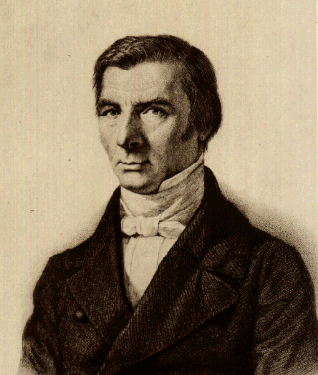

```{r setup, include=FALSE}
options(htmltools.dir.version = FALSE)
knitr::opts_chunk$set(echo=F,
                      message=F,
                      warning=F,
                      fig.retina=3,
                      fig.align="center")
library(tidyverse)
library(ggrepel)
library(mosaic)
set.seed(256)
update_geom_defaults("label", list(family = "Fira Sans Condensed"))
```

class: inverse

# Outline

## [From Medieval to the Proto-Modern World](#3)

## [Mercantilist Europe (c.1500-c.1800)](#16)

## [Classical Economics and the Rejection of Mercantilism](#48)

## [The Corn Laws](#72)
---

class: inverse, center, middle

# From Medieval to the Proto-Modern World

---

# The Peace of Westphalia (1648)

.center[

]

---

# The Black Death I

.pull-left[
.center[

]
]

--

.pull-right[

- Bubonic plague ravages Europe (esp. 1340s-1350s)

- 75-200 million die (30-60% of European population)

- Absolutely enormous social, political, economic consequences
  - Some good in the long run??

.source[North, Douglass C. and Robert Paul Thomas, (1973), *The Rise of the Western World: A New Economic History*, p 12-13]
]

---

# The Black Death Consequences I

.pull-left[
.center[

]
]

.pull-right[
.smaller[
- Reverses the effects of the Commercial Revolution from decimated population

- Real wages increase, real rents decrease, agricultural prices decrease

- Drastic shift in bargaining power from lords to peasants
  - Peasants gain longer leases and more direct property rights in land

- Scarce labor $\rightarrow$ incentive to seek out labor-saving innovations
]

.source[North, Douglass C. and Robert Paul Thomas, (1973), *The Rise of the Western World: A New Economic History*, p 12-13]

]

---

# The Black Death Consequences II

.pull-left[
.center[

.smallest[
King Richard II executing Wat Tyler, leader of the Peasants Revolt
]
]
]

.pull-right[
.smallest[
- Lords attempt to force a return to "normal"

- **1351 Statute of Laborers** in England: fix price controls, force down wages
  - Leads to Peasant Revolt (1381)

- Manorialism fades away slowly, Lords and peasants need more *flexibility* in prices and contracts to change with circumstances (not immutable custom)
  - Peasants become more "indepedent contractor" than feudal serf

.source[North, Douglass C. and Robert Paul Thomas, (1973), *The Rise of the Western World: A New Economic History*, p 12-13]

]
]

---

# Other Key Historical Events: The Reformation I

.pull-left[
.center[


]
]

.pull-right[
.smallest[
- Printing press emerges in Europe around 1450 via Johannes Gutenberg in Mainz
  - Prints the first "Gutenberg Bible" 

- Martin Luther publishes *95 Theses* against the Catholic church in 1517 Wittenberg

- Luther is far from the first Christian dissident
  - But he is the first to "get away with it"
  - protected by a powerful group of disgruntled lords away from Emperor Charles V
  - plus *he* has a *printing press!*
]
]

---

# Other Key Historical Events: The Reformation II

.center[

.quitesmall[
Over 300 years, religious wars overlaid political & military competition between early European states. Some of the most devastating until WWI.
]
]

---

# Other Key Historical Events: The Age of Discovery I

.center[


Byzantine Empire falls in 1453 to Ottoman Turks, which cuts off Europe's access to the Eastern trade; search for sea-routes to India and China begin
]

---

# Other Key Historical Events: The Age of Discovery II

.center[

]

---

# Other Key Historical Events: The Age of Discovery III

.pull-left[
.center[

]
]

.pull-right[

- Trade (and later colonization) with world is immensely profitable

- "Discovery" of New World & Atlantic trade
  - Colonies ship raw materials back to Europe in exchagne for manufactured goods
]

---

# Other Key Historical Events: The Age of Discovery IV

.pull-left[
.center[

]
]

.pull-right[

- Europe recovers from the Black Death, population growth from economic improvements

- Land-abundant, labor-scarce colonies are an "escape valve" for Malthusian pressures in land-scarce, labor-abundant Europe

- Also an escape valve for some religious dissident groups (Puritans, Protestant Dissenters, Quakers, etc.)

]

---

# Other Key Historical Events: The Age of Discovery IV

.pull-left[
.center[


The Amsterdam Stock Exchange (1601)
]
]

.pull-right[
.smaller[
- Towns become specialized and very wealthy cities

- .hi[“The Middle Class”] emerges in terms of wealth, power, and social status
  - “Freemen”, not peasants tied to the land
  - But not big landowners or aristocratic nobles
  
- Small-property-holding townspeople growing wealthy from manufacturing, shipping, or colonial trading ventures
]
]

---

class: inverse, center, middle

# Mercantilist Europe (c.1500-c.1800)

---

# Mercantilism I

.pull-left[
.center[

]
]

.pull-right[
.smallest[
- .hi-purple[Feudalism] fades away *slowly*: feudal custom and obligatory service replaced by cash payment and flexible contracts

- Rising merchant class grows *outside* of landlord-serf & patronage-dominated customs
  - in some countries (Netherlands & England), become part of the elite

- A new political-economic ideology of nationally-managed trade to replace feudalism: .hi[mercantilism]
]
]
---

# Mercantilism: The Rise of a New Class I

.pull-left[
.center[

]
]

.pull-right[
.center[

]
]

---

# Mercantilism: The Rise of a New Class II


.left-column[
.center[


Karl Marx (1818-1883)

Friedrich Engels (1820-1895)

]
]

.right-column[

.font90[
> "The feudal system of industry, in which industrial production was monopolised by closed guilds, now no longer sufficed for the growing wants of the new markets. The manufacturing system took its place. The guild-masters were pushed on one side by the manufacturing middle class; division of labour between the different corporate guilds vanished in the face of division of labour in each single workshop," $(\S2$ Proletarians and Communists)
]
]

.source[Marx, Karl and Friedrich Engels, 1848, [*Manifesto of the Communist Party*](https://www.marxists.org/archive/marx/works/1848/communist-manifesto/)]

---

# Mercantilism: The Rise of a New Class III


.left-column[
.center[


Karl Marx (1818-1883)

Friedrich Engels (1820-1895)

]
]

.right-column[

.font90[
> "The bourgeoisie, wherever it has got the upper hand, has put an end to all feudal, patriarchal, idyllic relations. It has pitilessly torn asunder the motley feudal ties that bound man to his "natural superiors," and has left remaining no other nexus between man and man than naked self-interest, than callous "cash payment." It has drowned the most heavenly ecstasies of religious fervour, of chivalrous enthusiasm, of philistine sentimentalism, in the icy water of egotistical calculation. It has resolved personal worth into exchange value, and in place of the numberless indefeasible chartered freedoms, has set up that single, unconscionable freedom---Free Trade," $(\S2$ Proletarians and Communists)
]
]

.source[Marx, Karl and Friedrich Engels, 1848, [*Manifesto of the Communist Party*](https://www.marxists.org/archive/marx/works/1848/communist-manifesto/)]

---

# Mercantilism: The Rise of a New Class IV


.left-column[
.center[


Karl Marx (1818-1883)

Friedrich Engels (1820-1895)

]
]

.right-column[

.font90[
> "The bourgeoisie, during its rule of scarce one hundred years, has created more massive and more colossal productive forces than have all preceding generations together. Subjection of Nature's forces to man, machinery, application of chemistry to industry and agriculture, steam-navigation, railways, electric telegraphs, clearing of whole continents for cultivation, canalisation of rivers, whole populations conjured out of the ground---what earlier century had even a presentiment that such productive forces slumbered in the lap of social labour?," $(\S2$ Proletarians and Communists)
]
]

.source[Marx, Karl and Friedrich Engels, 1848, [*Manifesto of the Communist Party*](https://www.marxists.org/archive/marx/works/1848/communist-manifesto/)]

---

# Mercantilism as a Political-Economic Ideology I

.pull-left[
.center[

]
]

.pull-right[

- What does the new merchant class want?

- Commerce! Trade!

- But not just any commerce...like any self-interest elite, they want commerce favorable to themselves
  - Monopolies, privileged terms of trade

]

---

# Mercantilism as a Political-Economic Ideology II

.pull-left[
.center[

]
]

.pull-right[

- Nation-states (monarchs) as principle actors

- National economies, stimulated by activist State interventions

- *The wealth of nations* is the quantity of their "specie" (gold and silver; i.e. money)
  - More money $\implies$ hire more soldiers $\implies$ win more wars $\implies$ gain more wealth
]

---

# Mercantilism as a Political-Economic Ideology III

.pull-left[
.center[

]
]

.pull-right[

- .hi-purple[Wealth comes from international trade]! 
  - Particularly producing selling **manufactures** abroad

- A nation must maintain a .hi-purple["favorable balance of trade"]
  - export more than you import

- International trade between nations/empires is war by other means
]

---

# Mercantilism as a Political-Economic Ideology IV

.pull-left[
.center[

]
]

.pull-right[

- Total wealth of the world is fixed - one must gain at others' expense

- Goal of economic activity is production

- *Monetary* factors determine economic activity & growth
]

---

# Mercantilism as a “Philosophy” I

.pull-left[
.center[

]
]

.pull-right[
.smaller[
- Possibility of analyzing, understanding, and directing *the economy*
  - Scientific revolution in physics (Newton)

- Mechanistic causal model of the economy via government control

]
]

---

# Mercantilism as a “Philosophy” II

.pull-left[
.center[

]
]

.pull-right[
.smaller[
- Fundamental conflict between private interests and public welfare
  - Can't change human nature, but can direct it for national wealth and power
  - Government as key mechanism to manage fallen people for common good

- Wealth of nation depended on the poverty of the many
  - Keep low wages to encourage work, production
]
]

---

# Policy Implications of Mercantilism I

.pull-left[
.center[

]
]

.pull-right[
- Maximize country's stock of gold and silver

- Mine gold & silver at home

- Seek colonies with gold & silver mines

- Prohibit exports of gold & silver

- Export goods to import gold & silver (as payments for our exports)
]

---

# Policy Implications of Mercantilism II

.pull-left[
.center[

]
]

.pull-right[
.smallest[
- Encourage domestic manufacturing for export

- Import raw materials
  - better yet, acquire colonies that have these so you don't have to give other countries gold or silver for them!

- Limit imports of manufactured goods from other countries

- Limit exports of raw materials
  - other countries can use them to make their own manufactures for export
]
]

---

# Policy Implications of Mercantilism II

.left-column[
.center[


Thomas Mun

1571-1641

]
]

.right-column[

> "The ordinary means therefore to encrease our wealth and treasure is by Forraign Trade, wherein wee must ever observe this rule; to sell more to strangers yearly than wee consume of theirs in value [sic]"

]
.source[Mun, Thomas, 1664, *England's Treasure by Forraign Trade or the Ballance of our Forraign Trade is the Rule of our Treasure*]

---

# Policy Implications of Mercantilism III

.pull-left[
.center[

]
]

.pull-right[
.smallest[
- Grant monopolies to encourage domestic production

- Poach inventors from other countries (grant protections & exemptions from guild laws)

- Sales of monopoly privileges a major source of State revenue (less costly than taxation)
  - Especially in France

- Political considerations: monarchs give privileges to dominant commercial elites in exchange for loyalty

]
]
---

# Trading Monopolies I

.pull-left[
.smaller[
- Crown granted .hi-purple[Letters Patent]

- Created a chartered trading company that had a monopoly on a trade
  - e.g. sugar, salt, tea, tobacco
  - or found a colony

- Crown often gave these to powerful elites as patronage for support
  - often *sold* as a source of State revenue

- Not all that different from a guild
]
]

.pull-right[
.center[

]
]

---

# Trading Monopolies II

.left-column[
.center[


Lord Edward Coke

1552--1634

Chief Justice (King's Bench)

]
]

.right-column[

> "A monopoly is an institution or allowance by the king, by his grant, commission, or otherwise...to any person or persons, bodies politic or corporate, for the sole buying, selling, making, working, or using of anything, whereby any person or persons, bodies politic or corporate, are sought to be restrained of any freedom or liberty that they had before, or hindered in their lawful trade."

]

---

# Trading Monopolies III

> "[A man lives] in a house built with monopoly bricks, with windows...of monopoly glass; heated by monopoly coal (in Ireland monopoly timber), burning in a grate made of monopoly iron...He washed himself in monopoly soap, his clothes in monopoly starch. He dressed in monopoly lace, monopoly linen, monopoly leather, monopoly gold thread...His clothes were dyed with monopoly dyes. He ate monopoly butter, monopoly currants, monopoly red herrings, monopoly salmon, and monopoly lobsters. His food was seasoned with monopoly salt, monopoly pepper, monopoly vinegar...He wrote with monopoly pens, on monopoly writing paper; read (through monopoly spectacles, by the light of monopoly candles) monopoly printed books," (quoted in Acemoglu and Robinson 2011, pp.187-188).

.source[Hill, Christoper, (1961), *The Century of Revolution*]

---

# Trading Monopolies IV

.pull-left[

.center[

]
]

.pull-right[
.smaller[
- .green[**Example**:] British Navigation Acts

> "[N]o goods of the growth, production, or manufacture of Asia, Africa, or America, shall be imported only by ships that belong to the people of the British Commonwealth."

- All trade with Britain and her colonies must use British ships and British seamen

- Intended to target rival European empires (esp. Dutch)

- A major grievance for the American colonists
]
]

---


# Trading Monopolies V

.pull-left[
.center[

]

]

.pull-right[

- Such mercantilist-inspired laws upset a lot of merchants (not politically-connected to the crown)

- Lots of resistance: golden age of piracy, smuggling, "interloping"
  - How many "Founding Fathers" of the U.S. made their fortunes!

- Empires needed to continuously patrol the oceans with their navies against smugglers, pirates, and other Imperial navies

- Navies are expensive, often turned to **privateers** and **Letters of Marque**
]

---

# Trading Monopolies VI

.pull-left[
.center[

]

]

.pull-right[

> The Congress shall have Power...
> To define and punish Piracies and Felonies committed on the high Seas, and Offenses against the Law of Nations;
> To declare War, **grant Letters of Marque and Reprisal**, and make Rules concerning Captures on Land and Water;
> - Constitution of the United States, Article I, $\S$ 8, Clauses 10-11

]

---

# Colonization and Imperialism I

.center[
European Empires at their (anachronistic) *maximal* historical extent

]

---

# Colonization and Imperialism II

.pull-left[

.center[

]
]

.pull-right[
- Portugal (c.1498+), Spain (c. 1492+), France (1530s+), Netherlands (1540s+), Britain (1600s+) establish colonies in Africa, Caribbean, Latin America, and Southern Asia

- Between 15<sup>th</sup> and 20<sup>th</sup>, many wars and changes of hands and fortunes of different European colonial overlords

- Several waves of colonialism - some are for conquest, some are for trade, some are for settlement

- Recall the connection to mercantilist political and economic philosophy
]

---

# Colonization and Imperialism II

- Acemoglu, Johnson, and Robinson:
  - Europeans chose one of two colonization strategies
  - Strategy chosen in 16<sup>th</sup> century *strongly* affects whether those former-colony countries are wealthy & developed or not *today*

.center[


Acemoglu, Johnson, and Robinson, 2001: 1253
]

.source[Acemoglu, Daron, Simon Johnson, and James A Robinson, (2001), "The Colonial Origins of Comparative Development: An Empirical Investigation," *American Economic Review* 91(5): 1369-1401

Acemoglu, Daron, Simon Johnson, and James A Robinson, (2002), "Reversal of Fortune: Geography and Institutions in the Making of the Modern World Income Distribution," *Quarterly Journal of Economics* 117(4): 1231-1294

Acemoglu, Daron, Simon Johnson, and James A Robinson, (2005), "Institutions as a Fundamental Cause of Long-Run Growth," Chapter 6 in Phillippe Aghion and Steven N. Durlauf, eds, *Handbook of Economic Growth*

Acemoglu, Daron and James A Robinson, (2012), *Why Nations Fail: The Origins of Power, Prosperity, and Poverty*]

---

# Extractive Institutions I

.pull-left[
.center[

]
]

.pull-right[

- .shout[Extractive colonies]: focused on exploiting indigenous population to extract resources to export to mother country

- Examples: Latin America, West Indies, sub-Saharan Africa, India
]

---

# Extractive Institutions II

.pull-left[
.center[


Potosi silver mines in (modern day) Bolivia
]
]

.pull-right[

- Set up highly stratified colonial elite with monopolies and privileges and enslave indigenous peoples

- Ex: Spanish *encomienda* system rewarded conquistadors with land and forced labor from conquered indigenious peoples, especially for mining gold and silver through the *mita*
]

---

# Extractive Institutions III

.pull-left[
.center[


]
]

.pull-right[

- Monopolies and property rights only for privileged colonial elite

- Wealth from extracted minerals and coerced labor

- Colonial elites stood to lose a lot from innovation, experimentation, creative destruction

]

---

# Inclusive Institutions I

.pull-left[
.center[

]
]

.pull-right[
- .shout[Inclusive colonies]: focused on creating mini "Neo-Europes"

- Less indigenous population to coerce into labor, had to sustain themselves from European settlers

- Settlers demanded more inclusive institutions

- Examples: United States, Canada, Australia, New Zealand

]

---

# Inclusive Institutions II

.pull-left[
.center[

]
]

.pull-right[
- Set up local self-governing institutions, a society of small landholders

- Focused primarily on agriculture and producing cash crops

- Trade with the mother countries: sell raw materials & buy manufactures

]

---

# Inclusive Institutions III

.pull-left[
.center[

]
]

.pull-right[
- Colonies are **labor scarce** and **land abundant** (the exact opposite of late Medieval Europe!)

- Frontier opens up possibility of **exit**: if your colony's governance is not effective, leave and **go on your own**
  - Colonies constrained to have effective governance to avoid losing their populations
  - Requires including citizens in political and economic life
]

---

# Inclusive Institutions IV

.pull-left[
.center[

]
]

.pull-right[
.smaller[
- Economy and politics were (*relatively*) open to competition

- Stronger protection of property rights, rule of law, "town-hall" style meetings

- Incentives for experimentation, innovation, creative destruction

- Some settlers were refugees or (often religious) dissidents fleeing Europe 
  - strong desire for autonomy and liberty,
  - strong suspicion of tyranny and monopoly
]
]

---

class: inverse, center, middle

# Classical Economics and the Rejection of Mercantilism

---

# Classical Economics Emerges in Opposition

.pull-left[
- .shout[Classical Economics] (1770s-1870) emerges through *joint opposition to mercantilism*
  - Half of Smith's *Wealth of Nations* (1776) is about why mercantilism is stupid

- Wealth $\neq$ money, but a nation's ability to consume (by production and trade)

- Monopolies and tariffs benefit a small group of domestic producers at the expense of everyone else

- Colonies and empire are expensive and often immoral

- .shout[(Classical) Liberalism]: focus on individual liberty, autonomy, democracy, free trade, pluralism; opposition to slavery, monopoly, and intolerance
]

.pull-right[
.center[

]
]

---

# Mercantilism: Wrong on the Source of Wealth

.left-column[
.center[


David Hume

1711-1776
]
]

.right-column[

> “Money is not, properly speaking, one of the subjects of commerce; but only the instrument which men have agreed upon to facilitate the exchange of one commodity for another. It is none of the wheels of trade: It is theoilwhich renders the motion of the wheels moresmooth and easy,” (p.135 in *Reader*) 

> “If we consider any one kingdom by itself, it is evident, that the greater or less plenty of money is of no consequence; since the prices of commodities are always proportioned to the plenty of money”

.source[Hume, David, 1752, “On Money” in *Political Discourses*]

]

---

# Mercantilism: Wrong on the Wealth of Nations I

.left-column[
.center[


Adam Smith

1723-1790
]
]
.right-column[

> “We trust with perfect security that the freedom of trade, without any attention of government, will always supply us with the wine which we have occasion for: and we trust with equal security that it will always supply us with all the gold and silver which we can afford to purchase or to employ,”

]

.source[Smith, Adam, 1776, *An Enquiry into the Nature and Causes of the Wealth of Nations*, (Book IV, Chapter 1: Of the Principle of the Mercantile System)]

---

# Mercantilism: Wrong on Trade

.left-column[
.center[


Adam Smith

1723-1790
]
]
.right-column[
.smallest[
> “As every individual, therefore, endeavours as much as he can...to employ his capital [in] that industry that its produce may be of the greatest value; every individual necessarily labours to render the annual revenue of the society as great as he can. He generally, indeed, neither intends to promote the public interest, nor knows how much he is promoting it. By preferring the support of domestic to that of foreign industry...and by directing that industry in such a manner as its produce may be of the greatest value, .hi[he intends only his own gain], and he is in this, as in many other cases, .hi[led by an invisible hand to promote an end which was no part of his intention]....hi[By pursuing his own interest he frequently promotes that of the society] more effectually than when he really intends to promote it..”

]
]
.source[Smith, Adam, 1776, *An Enquiry into the Nature and Causes of the Wealth of Nations*, Book IV, Chapter 2: Of restraints upon the importation from foreign countries of such goods as can be produced at home]

---

# Mercantilism: Wrong on *Managing* Trade

.left-column[
.center[


Adam Smith

1723-1790
]
]
.right-column[

> “The statesman, who should attempt to direct private people in what manner they ought to employ their capitals, would not only load himself with a most unnecessary attention, but assume an authority which could safely be trusted, not only to no single person, but to no council or senate whatever, and which would nowhere be so dangerous as in the hands of a man who had folly and presumption enough to fancy himself fit to exercise it.”

]

.source[Smith, Adam, 1776, *An Enquiry into the Nature and Causes of the Wealth of Nations*, Book IV, Chapter 2: Of restraints upon the importation from foreign countries of such goods as can be produced at home]

---

# Mercantilism: Wrong on the *Balance of Trade* I

.left-column[
.center[


David Hume

1711-1776
]
]

.right-column[


.smallest[
- Explodes mercantilist “balance of trade” doctrine via his great .hi[“price-specie flow mechanism”]:

> “Suppose four-fifths of all the money in Great Britain be annihilated in one night...what would be the consequence? Must not the price of all labour and commodities sink in proprtion, and everything be sold as cheap? What nation could then dispute with us in any foreign market...which to us would afford sufficient profit? In how little time, therefore, must this bring back the money which we had lost, and raise us to the level of all the neighbouring nations? Where, after we arrived, we immediately lose the advantage of the cheapness of labour and commodities; and the farther flowing in of money is stopped by our fulness and repletion,” (pp.146-147 in *Reader*)

]

.source[Hume, David, 1752, “Of the Balance of Trade” in *Political Discourses*]

]

---

# Mercantilism: Wrong on the *Balance of Trade* II

.left-column[
.center[


David Hume

1711-1776
]
]

.right-column[

.smallest[
- Gives the example inversely to underline the process:

> “Again, suppose, that all the money of Great Britain were multiplied fivefold in a night, must not the contrary effect follow? Must not all labour and commodities rise to such an exorbitant height, that no neighbouring nations could afford to buy from us; while their commodities, on the other hand, became comparatively so cheap, that, in spite of all the laws which could be formed, they would be run in upon us, and our money flow out; till we fall to a level with foreigners, and lose that great superiority of riches, which had laid us under such disadvantages?” (p.147 in *Reader*)

]

.source[Hume, David, 1752, “Of the Balance of Trade” in *Political Discourses*]

]

---

# Mercantilism: Wrong on the *Balance of Trade* III

.left-column[
.center[


Adam Smith

1723-1790
]
]
.right-column[
.smallest[

> “Nothing, however, can be more absurd than this whole doctrine of the balance of trade, upon which, not only these restraints, but almost all the other regulations of commerce are founded. When two places trade with one another, this doctrine supposes that, if the balance be even, neither of them either loses or gains; but if it leans in any degree to one side, that one of them loses and the other gains in proportion to its declension from the exact equilibrium. Both suppositions are false. A trade which is forced by means of bounties and monopolies may be and commonly is disadvantageous to the country in whose favour it is meant to be established, as I shall endeavour to show hereafter.  But that trade which, without force or constraint, is naturally and regularly carried on between any two places is always advantageous, though not always equally so, to both.”

]
]
.source[Smith, Adam, 1776, *An Enquiry into the Nature and Causes of the Wealth of Nations*, Book IV, Chapter 3: Of the extraordinary Restraints upon the Importation of Goods of almost all Kinds, from those Countries with which the Balance is supposed to be Disadvantageous, Part II]

---

# Mercantilism: Wrong on The *Balance of Trade* IV

.left-column[
.center[


Frederic Bastiat

1801-1850
]
]
.right-column[

> “[A]ccording to the theory of the balance of trade, France has a quite simple means of doubling her capital at any moment.  It suffices merely to pass its products through the customhouse, and then throw them into the sea.  In that case the exports will equal the amount of her capital; imports will be nonexistent and even impossible, and we shall gain all that the ocean has swallowed up,” ([The Balance of Trade](http://www.econlib.org/library/Bastiat/basEss13.html\#Chapter 13l) 1848).

]

---

# Mercantilism: Wrong on The *Balance of Trade* V

.left-column[
.center[


Frederic Bastiat

1801-1850
]
]
.right-column[

> “The truth is we should reverse the principle...and calculate the national profit from foreign trade in terms of the excess of imports over exports...But this theory, which is the correct one, leads directly to the principle of free trade...Assume, if it amuses you, that foreigners flood our shores with all kinds of useful goods, without asking anything from us; even if our imports are *infinite* and our exports *nothing*, I defy you to prove to me that we should be the poorer for it,” ([The Balance of Trade](http://www.econlib.org/library/Bastiat/basEss13.html\#Chapter 13l) 1848).

]

---

# Mercantilism: Wrong on The Point of Production

.left-column[
.center[


Adam Smith

1723-1790
]
]
.right-column[
.smaller[
> “.hi[Consumption is the sole end and purpose of all production]; and the interest of the producer ought to be attended to only so far as it may be necessary for promoting that of the consumer. The maxim is so perfectly self-evident that it would be absurd to attempt to prove it. But in .hi[the mercantile system] the interest of the .hi[consumer is almost constantly sacrificed to that of the producer]; and it seems to consider production, and not consumption, as the ultimate end and object of all industry and commerce.”

]

]

.source[Smith, Adam, 1776, *An Enquiry into the Nature and Causes of the Wealth of Nations*, Book IV, Chapter 9: Conclusion of the Mercantile system]

---

# Mercantilism: A Corporate Welfare Scheme I

.left-column[
.center[


Adam Smith

1723-1790
]
]
.right-column[

> “It cannot be very difficult to determine who have been the contrivers of this whole mercantile system; not the consumers, we may believe, whose interest has been entirely neglected; but the producers, whose interest has been so carefully attended to; and among this latter class our merchants and manufacturers have been by far the principal architects.”

]

.source[Smith, Adam, 1776, *An Enquiry into the Nature and Causes of the Wealth of Nations*, Book IV, Chapter 9: Conclusion of the Mercantile system]

---

# Mercantilism: A Corporate Welfare Scheme II

.left-column[
.center[


Frederic Bastiat

1801-1850
]
]
.right-column[
.smallest[
> From the Manufacturers of Candles, Tapers, Lanterns, Candlesticks, Street Lamps, Snuffers and Extinguishers, and from the Producers of Tallow, Oil, Resin, Alcohol, and Generally of Everything Connected with Lighting.

> To the Honorable Members of the Chamber of Deputes.
> We are suffering from the ruinous competition of a foreign rival who apparently works under conditions far superior to our own for the production of light that he is *flooding* the *domestic market* with it at an incredibly low price; for the moment he appears, our sales cease, all the consumers turn to him, and a branch of French industry whose ramifications are innumerable is all at once reduced to complete stagnation.

]

.source[Bastiat, Frederic, 1845, [The Candlemakers Petition](http://bastiat.org/en/petition.html).]
]
---

# Mercantilism: A Corporate Welfare Scheme III

.left-column[
.center[


Frederic Bastiat

1801-1850
]
]
.right-column[

.smallest[
> We ask you to be so good as to pass a law requiring the closing of all windows, dormers, skylights, inside and outside shutters, curtains, casements, bulls'-eyes, deadlights, and blinds - in short, all openings, holes, chinks, and fissures through which the light of the sun is wont to enter houses, to the detriment of the fair industries with which, we are proud to say, we have endowed the country, a country that cannot, without betraying ingratitude, abandon us today to so unequal a combat.

> [This will] encourage industry and increase employment...If you grant us a monopoly over the production of lighting during the day...we shall buy large amounts of tallow, charcoal, oil, resin, wax...and moreover, we and our numerous suppliers, having become rich, will consume a great deal and spread prosperity into all areas of domestic industry.

]
.source[Bastiat, Frederic, 1845, [The Candlemakers Petition](http://bastiat.org/en/petition.html).]
]

---

# End the Artificial Restrictions I

.left-column[
.center[


Adam Smith

1723-1790
]
]
.right-column[
.smaller[

> “Let the same natural liberty of exercising what species of industry they please, be restored to all his Majesty's subjects...break down the exclusive privileges of corporations, and repeal the statute of apprenticeship, both which are real encroachments upon natural liberty, and add to these the repeal of the [anti-migration laws] so that a poor workman, when thrown out of employment either in one trade or in one place, may seek for it in another trade or in another place without the fear either of a prosecution or of a removal.”

]
]
.source[Smith, Adam, 1776, *An Enquiry into the Nature and Causes of the Wealth of Nations*, Book IV, Chapter 9: Conclusion of the Mercantile system]

---

# End the Artificial Restrictions II

.left-column[
.center[


Adam Smith

1723-1790
]
]
.right-column[

> “The natural effort of every individual to better his own condition...is so powerful, that it is alone, and without any assistance, not only capable of carrying on the society to wealth and prosperity, but of surmounting a hundred impertinent obstructions with which the folly of human laws too often encumbers its operations.”

]

.source[Smith, Adam, 1776, *An Enquiry into the Nature and Causes of the Wealth of Nations*, Book IV, Chapter V]

---

# Mercantilism: Wrong on Colonies I

.left-column[
.center[


Adam Smith

1723-1790
]
]
.right-column[

.smaller[

> “Of all those expensive and uncertain projects, however, which bring bankruptcy upon the greater part of the people who engage in them, there is none perhaps more ruinous than the search after new silver and gold mines. It is perhaps the most disadvantageous lottery in the world, or the one in which the gain of those who draw the prizes bears the least proportion to the loss of those who draw the blanks: for though the prizes are few and the blanks many, the common price of a ticket is the whole fortune of a very rich man.”

]
]
.source[Smith, Adam, 1776, *An Enquiry into the Nature and Causes of the Wealth of Nations*, Book IV, Chapter VII, Part I: Of the Motives for establishing new Colonies]

---

# Mercantilism: Wrong on Colonies II

.left-column[
.center[


Adam Smith

1723-1790
]
]
.right-column[

> ”Folly and injustice seem to have been the principles which presided over and directed the first project of establishing those colonies; the folly of hunting after gold and silver mines, and the injustice of coveting the possession of a country whose harmless natives, far from having ever injured the people of Europe, had received the first adventurers with every mark of kindness and hospitality.”

]

.source[Smith, Adam, 1776, *An Enquiry into the Nature and Causes of the Wealth of Nations*, Book IV, Chapter VII, Part I: Of the Motives for establishing new Colonies]

---

# Mercantilism: Wrong on Colonies III

.left-column[
.center[


Adam Smith

1723-1790
]
]
.right-column[
.quitesmall[
> “To prohibit a great people, however, from making all that they can of every part of their own produce...is a manifest violation of the most sacred rights of mankind. Unjust, however, as such prohibitions may be, they have not hitherto been very hurtful to the colonies...

> “We must carefully distinguish between the effects of the colony trade and those of the monopoly of that trade. The former are always and necessarily beneficial; the latter always and necessarily hurtful. But the former are so beneficial that the colony trade, though subject to a monopoly, and notwithstanding the hurtful effects of that monopoly, is still upon the whole beneficial, and greatly beneficial; though a good deal less so than it otherwise would be...Under the present system of management, therefore, Great Britain derives nothing but loss from the dominion which she assumes over her colonies.”

]
]
.source[Smith, Adam, 1776, *An Enquiry into the Nature and Causes of the Wealth of Nations*, Book IV, Chapter VII, Part II: Causes of Prosperity of new Colonies]

---

# Mercantilism: Wrong on Slavery

.left-column[
.center[


Adam Smith

1723-1790
]
]
.right-column[

> “Fortune never exerted more cruelly her empire over mankind, than when she subjected those nations of heroes to the refuse of the jails of Europe, to wretches who possess the virtues neither of the countries which they come from, nor of those which they go to, and whose levity, brutality, and baseness, so justly expose them to the contempt of the vanquished.”


.source[Smith, Adam, 1749, *Theory of Moral Sentiments*, Part V, Chapter 2: Of the Influence of Custom and Fashion upon Moral Sentiments]

]

---

# Adam Smith on The System of Natural Liberty

.left-column[
.center[


Adam Smith

1723-1790
]
]
.right-column[
.smallest[
> “It is thus that .hi[every system which endeavours, either by extraordinary encouragements] to draw towards a particular species of industry a greater share of the capital of the society than what would naturally go to it, .hi[or, by extraordinary restraints], .hi[force from a particular species of industry some share of the capital which would otherwise be employed in it], is in reality .hi[subversive of the great purpose which it means to promote.] .hi[It retards, instead of accelerating, the progress of the society] towards real wealth and greatness; and diminishes, instead of increasing, the real value of the annual produce of its land and labour.”

]
]

.source[Smith, Adam, 1776, *An Enquiry into the Nature and Causes of the Wealth of Nations*, Book IV, Chapter IX: Of the Agricultural Systems, or of those Systems of Political Œconomy which Represent the Produce of Land as either the Sole or the Principal Source of the Revenue and Wealth Every Country]

]

---

# Adam Smith on The System of Natural Liberty

.left-column[
.center[


Adam Smith

1723-1790
]
]
.right-column[

.smallest[
> “All systems either of preference or of restraint, therefore, being thus completely taken away, .hi[the obvious and simple system of natural liberty] establishes itself of its own accord. .hi[Every man, as long as he does not violate the laws of justice, is left perfectly free to pursue his own interest his own way], and .hi[to bring both his industry and capital into competition with those of any other man], or order of men. The sovereign is completely discharged from a duty, in attempting to perform which he must always be exposed to innumerable delusions, and for the proper performance of which no human wisdom or knowledge could ever be sufficient; the duty of superintending the industry of private people, and of directing it towards the employments most suitable to the interest of the society,"

]
.source[Smith, Adam, 1776, *An Enquiry into the Nature and Causes of the Wealth of Nations*, Book IV, Chapter IX: Of the Agricultural Systems, or of those Systems of Political Œconomy which Represent the Produce of Land as either the Sole or the Principal Source of the Revenue and Wealth Every Country]

]

---

# Adam Smith on The System of Natural Liberty

.left-column[
.center[


Adam Smith

1723-1790
]
]
.right-column[
.smallest[
> “According to the system of natural liberty, .hi[the sovereign has only three duties] to attend to; three duties of great importance, indeed, but plain and intelligible to common understandings: .hi[first, the duty of protecting the society from violence and invasion] of other independent societies; .hi[second], the duty of .ji[protecting], as far as possible, .hi[every member of the society from the injustice or oppression of every other member] of it, or the duty of .hi[establishing an exact administration of justice]; and, .hi[third], the duty of .hi[erecting and maintaining certain public works and certain public institutions] which it can never be for the interest of any individual, or small number of individuals, to erect and maintain; because the profit could never repay the expense to any individual or small number of individuals, though it may frequently do much more than repay it to a great society.”

]
]
.source[Smith, Adam, 1776, *An Enquiry into the Nature and Causes of the Wealth of Nations*, Book IV, Chapter IX: Of the Agricultural Systems, or of those Systems of Political Œconomy which Represent the Produce of Land as either the Sole or the Principal Source of the Revenue and Wealth Every Country]

]

---

class: inverse, center, middle

# The Corn Laws

---

# The Corn Laws

.pull-left[

.smallest[
- Britain, long an exporter of corn, with population growth was no longer self-sufficient, became a net *importer* of corn after 1790
  - “Corn” = grains, wheat, barley, corn, etc.
  
- Corn prices (and land rents) rising rapidly
]

.quitesmall[
| Period | Price per quarter ton |
|--------|-------|
| 1770-1779 | 45 shillings |
| 1780-1789 | 45 shillings |
| 1790-1799 | 55 shillings |
| 1800-1809 | 82 shillings |
| 1810-1813 | 106 shillings |

]
]

.pull-right[
.center[


]
]

---

# The Corn Laws

.pull-left[

- Britain at war with France in Napoleonic Wars (1803-1815)

- Further disrupting imports of corn into Britain (and further raising corn prices)
  - and artificially protecting British corn producers from cheaper foreign competition

]

.pull-right[
.center[


]
]

---

# The Corn Laws

.pull-left[

- Landlords, fearing the end of the war, petitioned Parliament to get legal protection from cheaper, imported Corn

- .hi[The Corn Laws]: a series of tariffs and price floors by Parliament
  - 1791: Floor at 50 shillings
  - 1803: Floor at 63 shillings
]

.pull-right[
.center[


]
]

---

# The Corn Laws

.pull-left[

- Landlords argues high tariffs will keep grain prices low
  - Encourages greater investment in British agriculture, increasing supply which would lower prices

- Also argue that it corn prices allowed to fall, land would no longer be cultivated, leading to a greater shortage of corn than ever
]

.pull-right[
.center[


]
]

---

# Opposition to the Corn Laws

.left-column[
.center[


David Ricardo

1772-1823
]
]

.right-column[

.quitesmall[
> “If the interests of the landlord be of sufficient consequence, to determine us not to avail ourselves of all the benefits which would follow from importing corn at a cheap price, they should also influence us in rejecting all improvements in agriculture, and in the implements of husbandry; for it is as certain that corn is rendered cheap, rents are lowered, and the ability of the landlord to pay taxes, is for a time, at least, as much impaired by such improvements, as by the importation of corn. To be consistent then, let us by the same act arrest improvement, and prohibit importation.”

]

- 👆 satire!

.source[Ricardo, David, 1815, *Essay on the Influence of a Low Price of Corn on the Profits of Stock*]

]

---

# Ricardian Comparative Advantage

.left-column[
.center[


David Ricardo

1772-1823
]
]

.right-column[

.smallest[

> “To produce the wine in Portugal, might require only the labour of 80 men for one year, and to produce the cloth in the
same country, might require the labour of 90 men for the same time. It would therefore be advantageous for her to export wine in exchange for cloth. This exchange might even take place, notwithstanding that the commodity imported by Portugal could be produced there with less labour than in England. Though she could make the cloth with the labour of 90 men, she would import it from a country where it required the labour of 100 men to produce it, because it would be advantageous to her rather to employ her capital in the production of wine, for which she would obtain more cloth from England, than she could produce by diverting a portion of her capital from the cultivation of vines to the manufacture of cloth.”
]
]

.source[Ricardo, David, 1817, [*Principles of Political Economy and Taxation*](https://www.econlib.org/library/Ricardo/ricP.html?chapter_num=7#book-reader)]

---

# Ricardian Comparative Advantage

.left-column[
.center[


David Ricardo

1772-1823
]
]

.right-column[

.center[
Maximum Possible Production
]

|    | Wine | Cloth |
|----|-----:|--------:|
| .blue[England] | 5 | 10 |
| .red[Portugal] | 4 | 2 |

.center[
Opportunity Costs
]

|    | 1 Wine | 1 Cloth |
|----|-----:|--------:|
| .blue[England] | 2c | .b[0.5w] |
| .red[Portugal] | .b[0.5c] | 2w |

]

---

# Ricardian Comparative Advantage

.left-column[
.center[


David Ricardo

1772-1823
]
]

.right-column[
.smallest[
- Even in the presence of .hi[absolute advantage] (one country is more efficient at producing *all* goods), still better for them to specialize
  - A high opportunity cost of producing everything

- Pay others to perform a task, or purchase a good, and specialize in producing goods where you have the .hi-purple[lowest opportunity cost]

- This is the principle of .hi[comparative advantage]

- Ricardo called this the principle of “comparative cost”; Torrens calls it “comparative advantage” (and to be fair, Torrens wrote about it first)
  - in favor of free trade (import cheaper corn!)
  - preventing imports is like preventing superior production at home!
]
]

---

# The Corn Laws

.pull-left[
.smallest[
- Another claim that high prices were caused by high rents
  - Ricardo disgreed: believed rent was price-determined, not price-determining

- Ricardo concerned about how high tariffs would affect economic distribution in society: clearly favors landlords at others’ expense
  - Smith wasn’t clear enough on this

- Clear how the Corn Laws controversy forced Ricardo to think about these issues and build his own theory...
]
]
.pull-right[
.center[


]
]

---

# The Corn Laws Controversy...After Ricardo

.pull-left[
.smaller[
- Corn Laws remained a huge political issue in England in 1830s-1840s

- Industralization, rising population, but rising price of bread

- Great Famine in Ireland 1845-1849

- Radical liberals Richard Cobden & John Bright create the *Anti-Corn Law League* 1838
  - large rallies, major riots in London
  - Classical economists wrote vehemently against Corn Laws

]
]

.pull-right[
.center[
A Meeting of the Anti-Corn Law League


]
]

---

# The Corn Laws Controversy...After Ricardo

.left-column[
.center[


Richard Cobden

1804-1865

]

]

.right-column[

.smallest[
> "[Repealing the Corn laws would solve four problems.] First, it would guarantee the prosperity of the manufacturer by affording him outlets for his products. Second, it would relieve the Condition of England question by cheapening the price of food and ensuring more regular employment. Third, it would make English agriculture more efficient by stimulating demand for its products in urban and industrial areas. Fourth, it would introduce through mutually advantageous international trade a new era of international fellowship and peace. The only barrier to these four beneficent solutions was the ignorant self-interest of the landlords, the "bread-taxing oligarchy, unprincipled, unfeeling, rapacious and plundering."

]
]

---

# The Corn Laws Controversy...After Ricardo

.left-column[
.center[


Robert Peel

1788-1850

]

]

.right-column[

- Tory Robert Peel becomes P.M. 1841-1846

- Repeals the Corn Laws in 1846
  - ruins his political career
  - splits the Tory Party into the Whigs; radicals leave and become the Liberal Party

- Price of corn plummets
  - working classes can now afford food, more shift from farms to factories
  - last vestiges of feudal privileges eroding
]

---

# The Corn Laws Controversy...After Ricardo

.left-column[
.center[


]

]

.right-column[

- Tory Robert Peel becomes P.M. 1841-1846

- Repeals the Corn Laws in 1846
  - ruins his political career
  - splits the Tory Party into the Whigs; radicals leave and become the Liberal Party

- Price of corn plummets
  - working classes can now afford food, more shift from farms to factories
  - last vestiges of feudal privileges eroding
]
