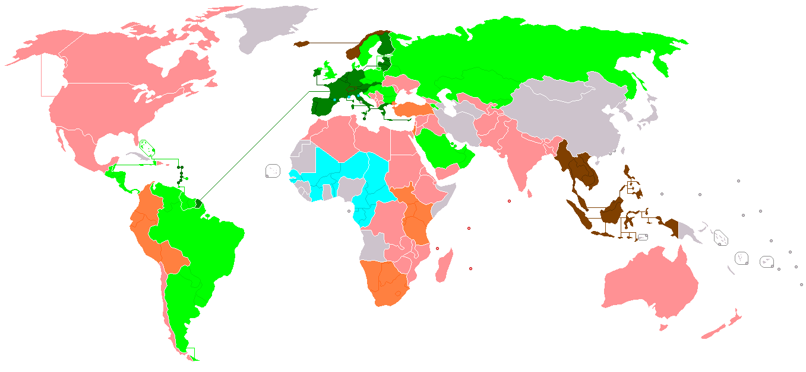

```{r setup, include=FALSE}
options(htmltools.dir.version = FALSE)
knitr::opts_chunk$set(echo=F,
                      message=F,
                      warning=F,
                      fig.retina=3,
                      fig.align="center")
library(tidyverse)
library(ggrepel)
library(mosaic)
set.seed(256)
update_geom_defaults("label", list(family = "Fira Sans Condensed"))
theme_slides<-ggthemes::theme_pander(base_family="Fira Sans Condensed", base_size = 14)
```

class: inverse

# Outline

## [Political Economy in a Liberal Democracy](#5)

## [An Example: Sugar Tariffs](#30)

## [Rent-Seeking](#39)

## [Who Gets Protection](#47)

---

# Where We’re At

.pull-left[
.smallest[
- **What We've Learned**: 
  - Predict & understand why and what countries trade (Trade Models)
  - Consequences of trade barriers (tariffs, quotas, subsidies, etc)
  - Intellectual history of free trade & protectionist arguments
  
- **What's Left**: for good or bad, **why** do countries have the trade policies they have today? 
  - A theory of how politics interacts with economics: \alert{political economy}
]
]

.pull-right[
.center[

]
]

---

# Where We’re At

.pull-left[
.smallest[
- If you agree with the following premises:
  1. Trade barriers are on in general harmful and inefficient on net for a society
  2. Trade barriers *do* benefit specific groups of people
  
- We need to answer two questions:
  1. Why do trade barriers that are often inefficient and welfare-reducing *persist*? 
  2. How is it possible to get groups or countries to *agree to reduce* trade barriers? 

]
]
.pull-right[
.center[

]
]

---

# International Trade Negotiations

.center[

]

---

# International Trade Negotiations

.pull-left[
.center[

]
]
.pull-right[
- Adam Smith cautions us that we should pay heed to the transitions of the labor market in moving to free trade abruptly

- Immediate abolition of all tariffs and protections, while it will help all consumers around the world and at home, will lead to temporary unemployment in the inefficient, domestically-protected industries

]

---

# The Strategy of Trade Agreements

.pull-left[
- Unilateral free trade is the theoretically ideal strategy
    - we immediately drop all tariffs
    - economists continuously recommend this, dispersed benefits outweigh concentrated costs
  
- But this is not good politics!
]

.pull-right[
.center[


.source[[Source](https://www.nytimes.com/2018/06/20/opinion/trump-trade-tariffs-china.html}{NY Times June 20, 2018)]
]
]
---

# The Strategy of Trade Agreements

.pull-left[
- Political infeasibility of unilateral free trade
  - note: opposite of politically stable policy: dispersed benefit, concentrated cost
  - Domestic import-competing industries are best-organized political group, stand to *lose* a large concentrated benefit with free trade
  
- Bilateral/multilateral trade agreements provide .hi[commitment strategies] for each nation
  - stack domestic exporters (who want access to foreign markets) as opposing concentrated political force to fight to open up trade
  - multiple groups in multiple countries with vested interest in keeping trade open
  - difficult for politicians in one country to impose tariffs to protect domestic importers (now have to fight exporters, not to mention other countries)

]

.pull-right[
.center[


.source[[Source](https://www.nytimes.com/2018/06/20/opinion/trump-trade-tariffs-china.html}{NY Times June 20, 2018)]
]
]

---
# The Strategy of Trade Agreements

.pull-left[
.center[

]

]

.pull-right[
.center[

]

]

.smallest[

- Recall effects of a large country’s tariffs on world trade

- Compared to no-tariff, U.S. gains $D-(A+B)$ from tariff

- Foreign country loses $A+B+D$ from U.S. tariff
]

---

# The Strategy of Trade Agreements

.pull-left[
- Now consider two big countries: .red[U.S.] and .blue[China] negotiating with one another

- If one has a tariff, they gain $D-(A+B)$ and the other loses $-(D+E)$

- If both have tariffs, both lose $A+B+E$

- If neither have tariffs (free trade), they earn 0
]

.pull-left[
.center[

]
]

---

# The Strategy of Trade Agreements

.pull-left[
- Now consider two big countries: .red[U.S.] and .blue[China] negotiating with one another

- If you’re having trouble keeping track, let’s simplify
]

.pull-left[
.center[

]
]

---

# The Strategy of Trade Agreements

.pull-left[
- Now consider two big countries: .red[U.S.] and .blue[China] negotiating with one another

- If you’re having trouble keeping track, let’s simplify

- .hi-purple[Nash Equilibrium]:
]

.pull-left[
.center[

]
]

---

# The Strategy of Trade Agreements

.pull-left[
- Now consider two big countries: .red[U.S.] and .blue[China] negotiating with one another

- If you’re having trouble keeping track, let’s simplify

- .hi-purple[Nash Equilibrium]: (.red[Tariff], .blue[Tariff])

- Each country has a dominant strategy to give in to political pressure for protectionism
]

.pull-left[
.center[

]
]

---

# The Strategy of Trade Negotiations

.pull-left[
- Why aren't all trade negotiations a single sentence “We hereby eliminate all tariffs?”

- Trade agreements are often hundreds or thousands of pages long!

]

.pull-right[
.center[

]
]

---

# The Strategy of Trade Negotiations

.pull-left[
- There is a reason the public is not allowed into the "room where it happens"
  - there's a reason *Congress* does is not allowed into the room!
  
- If negotiations were public, or open to Congress:
  - Different interest groups would try to grab their own carve outs and exemptions 

]

.pull-right[
.center[

]
]

---

class: inverse, center, middle

# History of Recent Trade Liberalization

---

# Smoot-Hawley Tariff Act and “Beggar Thy Neighbor”

.pull-left[
.center[

]
]
.pull-right[
center[

]
]

---

# Smoot-Hawley Tariff Act and “Beggar Thy Neighbor”

.pull-left[
.center[

]
]
.pull-right[
center[

]
]

---

# Most-Favored Nation

.pull-left[
- 1934 Trade Agreements Act

- Authorized the president to negotiate *mutual* tariff reductions with other countries by up to 50% from Smoot-Hawley tariff

- Based on .hi[most favored nation (MFN) principle]
]

.pull-right[

]

---

# GATT

.pull-left[

- 1947 *General Agreement on Tariffs and Trade (GATT)*

- First major multilateral agreement

- Set in motion 9 major “rounds” of negotiations through 2001 
]

.pull-right[
.center[

]
]

---

# GATT

.pull-left[

- 1947 *General Agreement on Tariffs and Trade (GATT)*

- Principle of nondiscrimination (MFN)

- Elimination of non-tariff barriers except agriculture (!)

- Resolution of trade disputes through GATT institutions

- Binding of tariffs (not allowed to raise tariffs (with exceptions))
]

.pull-right[
.center[

]
]

---

# GATT

.pull-left[

- Protectionist measures in U.S. in 1950s:
  - “Peril-point provisions”
  - “Escape clause”
  - “National security clause”

- 1962 Trade Expansion Act: created Trade Adjustment Assistance (TAA)
]

.pull-right[
.center[

]
]

---

# GATT

.pull-left[

- Uruguay Round (8th of GATT, 1986-1993, concluded 1994)
  - Tariffs
      - Industrial products fell from 4.7% on average to 3%
      - Share of goods with no tariffs increased from 20-22% to 40-45%
      - Tariffs removed on pharmaceuticals, construction equipment, medical equipment, paper products, steel
  - Quotas
      - Quotas on agricultural products to be replaced with less restrictive tariffs by 1999
      - Quotas on textiles to be replaced with less restrictive tariffs by 2004
]

.pull-right[
.center[

]
]

---

# GATT

.pull-left[

- Uruguay Round (8th of GATT, 1986-1993, concluded 1994)
  - Antidumping: Doesn't outright ban countervailing duties, but focuses more on tougher action through GATT institutions
  - Subsidies
      - Volume of subsidized agricultural products to be reduced 21% by 1999
      - Government subsidies for industrial research to be limited to 50% of cost
  - Safeguards
      - Countries banned from using health and safety laws not based on scientific research
      - Temporary tariffs allowed to protect domestic industry against temporary import surges
]

.pull-right[
.center[

]
]


---

# GATT $\rightarrow$ WTO

.pull-left[

- Uruguay Round (8th of GATT, 1986-1993, concluded 1994)
  - Intellectual property
      - 20 year protection of patents, trademarks, and copyrights
      - 10 year phase-in period allowed for developing countries' pharmaceuticals

- .hi[World Trade Organization (WTO)]
  - GATT Secretariat is replaced and extended by institutions of the WTO
]

.pull-right[
.center[

]
]

---

# WTO

.center[


.smallest[
.green[WTO Members], .blue[WTO Members dually represented by EU], .yellow[Observer nations], .red[Non-members]
]

]

---

# WTO

.pull-left[

- WTO principles:
  - Nondiscrimination
  - Reciprocity
  - Binding and enforceable commitments
  - Transparency
  - Safety Valves

- Organization:  Councils for Trade in Goods, Trade-Related Aspects of Intellectual Property Rights (TRIPS), Trade in Services, Trade Negotiations Committee

- Dispute Resolution Mechanisms
]

.pull-right[
.center[

]
]

---

# WTO

.pull-left[

- Estimated that Uruguay Round (Salvatore (2011: 164)):
  - increased the volume of world trade by 20% (25% from manufacturing, 75% from agriculture)
  - increased world income gains by $349 billion ($164 billion from agriculture, $130 billion from manufacturing, $55 billion from services)
  - developing countries receiving 42% of the gains - double their share of world GDP
  
]

.pull-right[
.center[

]
]

---

# WTO

.pull-left[

- 2001 China admitted to WTO

- 2002 Congress granted President “fast-track authority” to negotiate trade deals, expired in 2007
  
]

.pull-right[
.center[

]
]

---

# WTO

.pull-left[

- Doha Round (9th of GATT, 2001-?, failed so far)

- Disagreements over agricultural subsidies

- Debates about GMOs, health and safety issues, environmental protection
]

.pull-right[
.center[

]
]

---

# Historical Strategies to Achieve Free-er Trade

.pull-left[

- .hi[Unilateral free trade]: (very rare), a single country removes all trade restrictions against other countries

- .hi[Bilateral Trade Agreements]: two countries agree to eliminate trade barriers on goods traded just between their two countries
  - The most popular strategy, most countries have bilateral agreements with others

- .hi[Customs Union/Common Market]: several countries (usually in a region) agree to eliminate trade barriers 
  - U.S. Constitution; European Union; North American Free Trade Agreement (NAFTA); Trans-Pacific Partnership (TPP)
]

---

# Trade Liberalization

.center[


.smallest[

- Dark green: Economic and monetary union (CSME/EC$, EU/€, Switzerland–Liechtenstein/CHF)
- Light green: Economic union (CSME, EU–UK, EAEU, MERCOSUR, GCC, SICA)
- Cyan: Customs and monetary union (CEMAC/XAF, UEMOA/XOF)
- Brown: Common market (EEA–Switzerland, ASEAN[dubious – discuss])
- Orange:
Customs union (CAN, EAC, EUCU, SACU)
- Pink: Multilateral Free Trade Area (CEFTA, CISFTA, COMESA, CPTPP, DCFTA, EFTA, GAFTA, USMCA, SAFTA, AANZFTA, PAFTA, SADCFTA)
[Map Source](http://en.wikipedia.org/wiki/Trade_bloc)
]

]

---
# Trade Creation & Trade Diversion

.pull-left[

- Consider the market for T-shirts in the United States
]

.pull-right[
```{r}
Demand=function(x){20-x}
Supply=function(x){x}

p<-ggplot(data.frame(x=c(0,12)), aes(x=x))+
  stat_function(fun=Demand, geom="line", color="blue", size=2)+
  geom_label(x=3,y=Demand(3), color = "blue", label="Demand (Domestic)")+
  stat_function(fun=Supply, geom="line", color="red", size=2)+
  geom_label(x=17,y=Supply(17), color = "red", label="Supply (Domestic)")+
  #geom_segment(x = 0, y = 10, xend=10, yend=10, linetype="dotted", size=1)+
  #geom_segment(x = 10, y = 10, xend=10, yend=0, linetype="dotted", size=1)+
  labs(x = "Quantity (Billions)",
       y = "Price")+
  scale_x_continuous(breaks=seq(0,20,2),
                     limits=c(0,22),
                     expand=c(0,0))+
  scale_y_continuous(breaks=seq(0,20,2),
                     labels = scales::dollar,
                     limits=c(0,22),
                     expand=c(0,0))+
  ggthemes::theme_pander(base_family = "Fira Sans Condensed", base_size=18)
p
```
]

---

# Trade Creation & Trade Diversion

.pull-left[

- Consider the market for T-shirts in the United States

- Suppose the United States can import T-shirts from .pink[Japan]
]

.pull-right[
```{r}
p+geom_hline(yintercept=3, size = 2, color = "#e64173")+
  geom_label(x=18,y=3, label="Supply (Japan)", color = "#e64173", size = 3)
```
]

---

# Trade Creation & Trade Diversion

.pull-left[

- Consider the market for T-shirts in the United States

- Suppose the United States can import T-shirts from .pink[Japan] or .purple[Mexico]
  - .pink[Japan] is more efficient ($3/shirt) than .purple[Mexico] ($4/shirt)
]

.pull-right[
```{r}
p+geom_hline(yintercept=3, size = 2, color = "#e64173")+
  geom_label(x=18,y=3, label="Supply (Japan)", color = "#e64173", size = 3)+
  geom_hline(yintercept=4, size = 2, color = "#6A5ACD")+
  geom_label(x=18,y=4, label="Supply (Mexico)", color = "#6A5ACD", size = 3)
```
]

---

# Trade Creation & Trade Diversion

.pull-left[

- Consider the market for T-shirts in the United States

- Suppose the United States can import T-shirts from .pink[Japan] or .purple[Mexico]
  - .pink[Japan] is more efficient ($3/shirt) than .purple[Mexico] ($4/shirt)

- Under free trade, U.S. would import 14 Bn from .pink[Japan] (cheapest), and 0 from .purple[Mexico]
]

.pull-right[
```{r}
p+geom_hline(yintercept=3, size = 2, color = "#e64173")+
  geom_label(x=18,y=3, label="Supply (Japan)", color = "#e64173", size = 3)+
  geom_hline(yintercept=4, size = 2, color = "#6A5ACD", alpha = 0.25)+
  geom_label(x=18,y=4, label="Supply (Mexico)", color = "#6A5ACD", size = 3)+
  geom_segment(x=3,y=0, xend=3, yend=3, size = 1, linetype = "dotted")+
  geom_segment(x=17,y=0, xend=17, yend=3, size = 1, linetype = "dotted")+
  annotate("segment", x = 3, xend = 17, y = 2, yend = 2, color = "black", size=2, alpha=1, arrow=arrow(length=unit(0.5,"cm"), ends="both", type="closed"))+
  geom_label(x = 10, y = 2, color = "black", label = "Imports")
```
]

---

# Trade Creation & Trade Diversion

.pull-left[

- Consider the market for T-shirts in the United States

- Suppose the United States can import T-shirts from .pink[Japan] or .purple[Mexico]
  - .pink[Japan] is more efficient ($3/shirt) than .purple[Mexico] ($4/shirt)

- Suppose instead the U.S. has a 100% tariff on *any/all* imported T-shirts
  - .pink[Japanese] imports are still cheapest (but at $6/shirt now, vs. $8 .purple[Mexican] shirts)
  - Imports 8 Bn from .pink[Japan] and 0 Bn from .purple[Mexico]
]

.pull-right[
```{r}
p+geom_hline(yintercept=3, size = 2, color = "#e64173", alpha =0.25)+
  geom_label(x=18,y=3, label="Supply (Japan)", color = "#e64173", size = 3)+
  geom_hline(yintercept=4, size = 2, color = "#6A5ACD", alpha = 0.25)+
  geom_label(x=18,y=4, label="Supply (Mexico)", color = "#6A5ACD", size = 3)+
  
  geom_hline(yintercept=6, size = 2, color = "#e64173", alpha =1.0)+
  geom_label(x=18,y=6, label="Supply (Japan) + t", color = "#e64173", size = 3, alpha=1.0)+
  geom_hline(yintercept=8, size = 2, color = "#6A5ACD", alpha = 1.0)+
  geom_label(x=18,y=8, label="Supply (Mexico) + t", color = "#6A5ACD", size = 3, alpha = 1.0)+
  
  geom_segment(x=6,y=0, xend=6, yend=6, size = 1, linetype = "dotted")+
  geom_segment(x=14,y=0, xend=14, yend=6, size = 1, linetype = "dotted")+
  annotate("segment", x = 6, xend = 14, y = 2, yend = 2, color = "black", size=2, alpha=1, arrow=arrow(length=unit(0.5,"cm"), ends="both", type="closed"))+
  geom_label(x = 10, y = 2, color = "black", label = "Imports")
```
]

---

# Trade Creation & Trade Diversion

.pull-left[

- Now suppose the U.S. and .purple[Mexico] enter a free trade agreement
  - U.S. drops tariffs on .purple[Mexico] to 0%
  - Keeps tariff on .pink[Japan]

- Now .purple[Mexican] T-shirts (with no tariff) are cheaper at $4/shirt compared with .pink[Japan] (still with tariff) at $6/shirt!
  - U.S. imports 12 Bn from .purple[Mexico], imports 0 Bn from .pink[Japan]
]

.pull-right[
```{r}
p+geom_hline(yintercept=3, size = 2, color = "#e64173", alpha =0.25)+
  geom_label(x=18,y=3, label="Supply (Japan)", color = "#e64173", size = 3)+
  geom_hline(yintercept=4, size = 2, color = "#6A5ACD", alpha = 1.0)+
  geom_label(x=18,y=4, label="Supply (Mexico)", color = "#6A5ACD", size = 3, alpha = 1.0)+
  
  geom_hline(yintercept=6, size = 2, color = "#e64173", alpha =1.0)+
  geom_label(x=18,y=6, label="Supply (Japan) + t", color = "#e64173", size = 3, alpha=1.0)+
  geom_hline(yintercept=8, size = 2, color = "#6A5ACD", alpha = 0.25)+
  geom_label(x=18,y=8, label="Supply (Mexico) + t", color = "#6A5ACD", size = 3)+
  
  geom_segment(x=4,y=0, xend=4, yend=4, size = 1, linetype = "dotted")+
  geom_segment(x=16,y=0, xend=16, yend=4, size = 1, linetype = "dotted")+
  annotate("segment", x = 4, xend = 16, y = 2, yend = 2, color = "black", size=2, alpha=1, arrow=arrow(length=unit(0.5,"cm"), ends="both", type="closed"))+
  geom_label(x = 10, y = 2, color = "black", label = "Imports")
```
]

---

# Trade Creation & Trade Diversion

.pull-left[

- **Effects from the free trade agreement** (with .purple[Mexico]):

1. .hi-turquoise[Trade creation]: U.S. imports more T-shirts (compared to under *equal* tariffs), all from .purple[Mexico]

2. .hi-turquoise[Trade diversion]: .pink[Japan] is actually a more efficient producer than .purple[Mexico] (if no tariffs), but U.S. only trades with .purple[Mexico] because .hi[Japan] is outside free trade zone
  - U.S. trade diverted from .pink[Japan] to .purple[Mexico]
  
]

.pull-right[
```{r}
p+geom_hline(yintercept=3, size = 2, color = "#e64173", alpha =0.25)+
  geom_label(x=18,y=3, label="Supply (Japan)", color = "#e64173", size = 3)+
  geom_hline(yintercept=4, size = 2, color = "#6A5ACD", alpha = 1.0)+
  geom_label(x=18,y=4, label="Supply (Mexico)", color = "#6A5ACD", size = 3, alpha = 1.0)+
  
  geom_hline(yintercept=6, size = 2, color = "#e64173", alpha =1.0)+
  geom_label(x=18,y=6, label="Supply (Japan) + t", color = "#e64173", size = 3, alpha=1.0)+
  geom_hline(yintercept=8, size = 2, color = "#6A5ACD", alpha = 0.25)+
  geom_label(x=18,y=8, label="Supply (Mexico) + t", color = "#6A5ACD", size = 3)+
  
  geom_segment(x=4,y=0, xend=4, yend=4, size = 1, linetype = "dotted")+
  geom_segment(x=16,y=0, xend=16, yend=4, size = 1, linetype = "dotted")+
  annotate("segment", x = 4, xend = 16, y = 2, yend = 2, color = "black", size=2, alpha=1, arrow=arrow(length=unit(0.5,"cm"), ends="both", type="closed"))+
  geom_label(x = 10, y = 2, color = "black", label = "Imports")
```
]

---

