```{r setup, include=FALSE}
options(htmltools.dir.version = FALSE)
knitr::opts_chunk$set(echo=F,
                      message=F,
                      warning=F,
                      fig.retina=3,
                      fig.align="center")
library(tidyverse)
library(ggrepel)
library(mosaic)
set.seed(256)
update_geom_defaults("label", list(family = "Fira Sans Condensed"))
theme_slides<-ggthemes::theme_pander(base_family="Fira Sans Condensed", base_size = 14)
```

class: inverse

# Outline

## [The Strategy of Trade Agreements](#5)

## [History of Recent Trade Liberalization](#30)

## [The Economic Effects of Trade Agreements](#39)

---

# Where We’re At

.pull-left[
.smallest[
- **What We've Learned**: 
  - Predict & understand why and what countries trade (Trade Models)
  - Consequences of trade barriers (tariffs, quotas, subsidies, etc)
  - Intellectual history of free trade & protectionist arguments
  
- **What's Left**: for good or bad, **why** do countries have the trade policies they have today? 
  - A theory of how politics interacts with economics: .hi[political economy]
]
]

.pull-right[
.center[

]
]

---

# Where We’re At

.pull-left[
.smallest[
- If you agree with the following premises:
  1. Trade barriers are on in general harmful and inefficient on net for a society
  2. Trade barriers *do* benefit specific groups of people
  
- We need to answer two questions:
  1. Why do trade barriers that are often inefficient and welfare-reducing *persist*? 
  2. How is it possible to get groups or countries to *agree to reduce* trade barriers? 

]
]
.pull-right[
.center[

]
]

---

# International Trade Negotiations

.center[
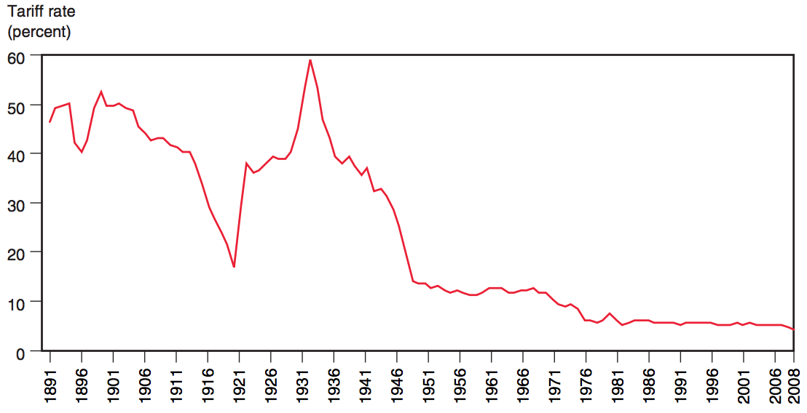
]

---

class: inverse, center, middle

# The Strategy of Trade Agreements

---

# The Strategy of Trade Agreements

.pull-left[
- Unilateral free trade is the theoretically ideal strategy
    - we immediately drop all tariffs
    - economists continuously recommend this, dispersed benefits outweigh concentrated costs
  
- But this is not good politics!
]

.pull-right[
.center[
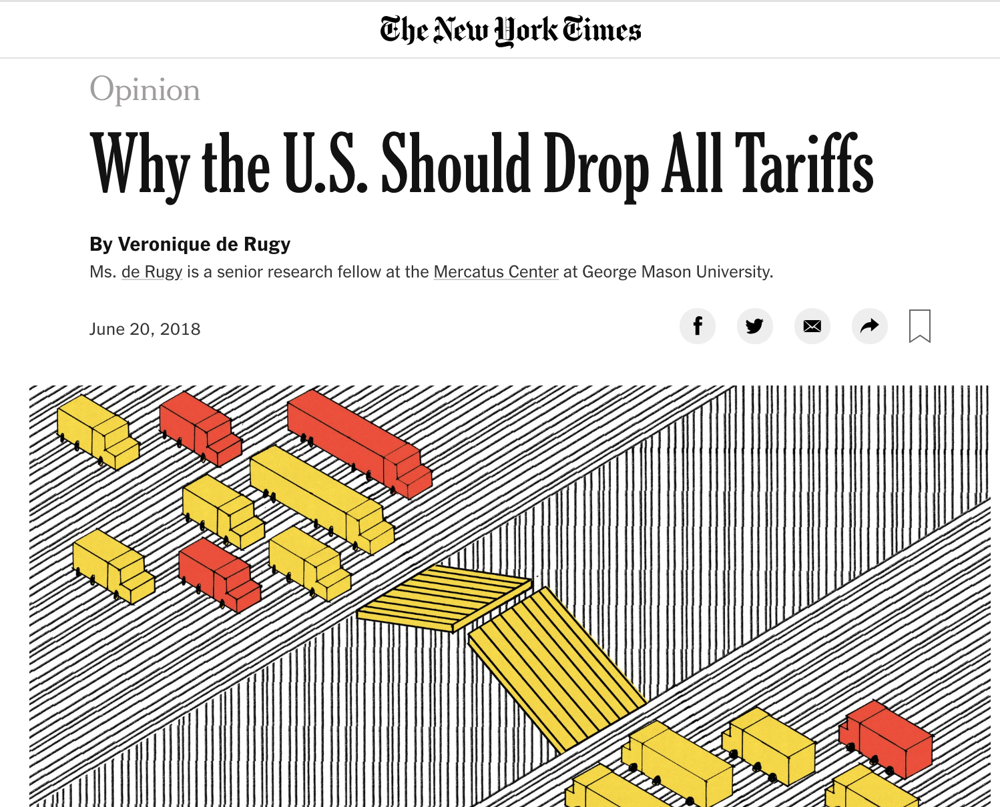

.source[[Source](https://www.nytimes.com/2018/06/20/opinion/trump-trade-tariffs-china.html}{NY Times June 20, 2018)]
]
]
---

# The Strategy of Trade Agreements

.pull-left[
- Political infeasibility of unilateral free trade

- Note: opposite of politically stable policy: dispersed benefit, concentrated cost!

- Domestic import-competing industries are best-organized political group, stand to *lose* a large concentrated benefit with free trade
]

.pull-right[
.center[

]

]

---

# The Strategy of Trade Agreements

.pull-left[
.center[
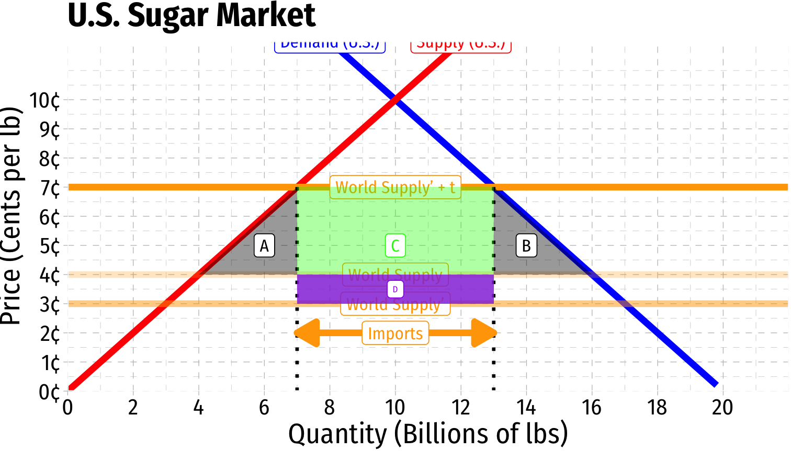
]

]

.pull-right[
.center[
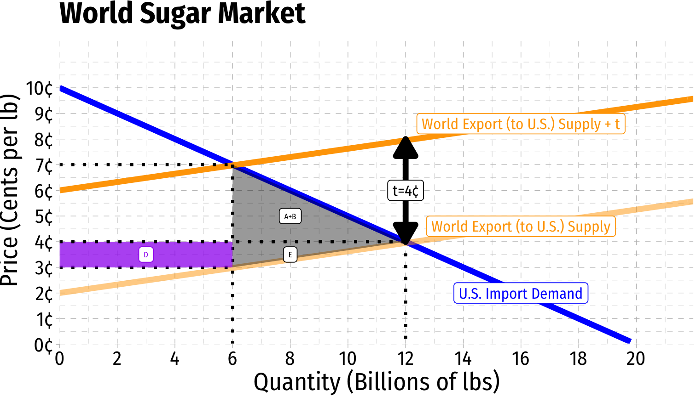
]

]

.smallest[

- Recall effects of a large country’s tariffs on world trade

- Compared to no-tariff, U.S. gains $D-(A+B)$ from tariff

- Foreign country loses $A+B+D$ from U.S. tariff
]

---

# The Strategy of Trade Agreements

.pull-left[
- Now consider two big countries: .red[U.S.] and .blue[China] negotiating with one another

- If one has a tariff, they gain $D-(A+B)$ and the other loses $-(D+E)$

- If both have tariffs, both lose $A+B+E$

- If neither have tariffs (free trade), they earn 0
]

.pull-left[
.center[
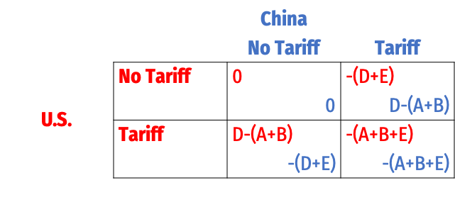
]
]

---

# The Strategy of Trade Agreements

.pull-left[
- Now consider two big countries: .red[U.S.] and .blue[China] negotiating with one another

- If you’re having trouble keeping track, let’s simplify
]

.pull-left[
.center[
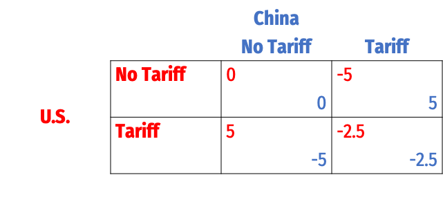
]
]

---

# The Strategy of Trade Agreements

.pull-left[
- Now consider two big countries: .red[U.S.] and .blue[China] negotiating with one another

- If you’re having trouble keeping track, let’s simplify

- .hi-purple[Nash Equilibrium]:
]

.pull-left[
.center[

]
]

---

# The Strategy of Trade Agreements

.pull-left[
- Now consider two big countries: .red[U.S.] and .blue[China] negotiating with one another

- If you’re having trouble keeping track, let’s simplify

- .hi-purple[Nash Equilibrium]: (.red[Tariff], .blue[Tariff])

- Each country has a dominant strategy to give in to political pressure for protectionism
]

.pull-left[
.center[

]
]

---

# Adam Smith: Strategic Trade Policy

.left-column[
.center[


Adam Smith

1723-1790
]
]
.right-column[

.quitesmall[

> “[I]t may sometimes be a matter of deliberation [how to remove tariffs] when some foreign nation restrains by high duties or prohibitions the importation of some of our manufactures into their country. Revenge in this case naturally dictates retaliation, and that we should impose the like duties and prohibitions upon the importation of some or all of their manufactures into our country...nations accordingly seldom fail to retaliate in this manner.”

> “There may be a good policy in retaliations of this kind...The recovery of a great foreign market will generatlly more than compensate the transitory inconveniency of paying dearer during a short time for some sorts of goods. To judge whether such retaliations are likely to produce such an effect...[belongs] to the skill of that insidious and crafty animal, vulgarly called the statesman or politician, whose councils are directed by the momentary fluctuations of affairs.”

]

.source[Smith, Adam, 1776, *An Enquiry into the Nature and Causes of the Wealth of Nations*, (Book IV, Chapter 2]
]

---

# Torrens & Mill: Strategic Trade Policy

.left-column[
.center[


.smallest[
L: Col. Robert Torrens (1780—1864)

R: John Stuart Mill (1806-1873)
]
]
]

.right-column[

.smallest[
> “[Reciprocity] would hold out to [foreign countries] a powerful inducement to act upon the principles of reciprocal freedom” - Torrens

> “[C]onsiderations of reciprocity...are of material importance when the repeal of duties...is discussed. A country cannot be expected to renounce the power of taxing foreigners, unless foreigners will in return practise towards itself the same forbearance. The only mode in which a country can save itself from being a loser by the duties imposed by other countries on its commodities, is to impose corresponding duties on theirs.” - Mill

]
]

---

# Finding Commitments: Bilateral Agreements

.pull-left[
.quitesmall[
- .hi[Bilateral/multilateral trade agreements] provide .hi-purple[commitment strategies] for each nation to reduce tariffs

- Traditionally, it’s concentrated benefits to domestic importers who lobby politicians to put up tariffs

- With a trade agreement, domestic *exporters* (who *want* free access to foreign markets) act as a concentrated political force fighting to lower tariffs

- Creates *multiple* groups in *multiple* countries with vested interest in keeping trade open (tariffs down)

- More concentrated & strongly interested groups fighting *against* tariffs than *for* tariffs!
  - Less incentive for domestic politician to cater to protectionist interests
]
]

.pull-right[
.center[


.quitesmall[
*Odysseus and the Sirens* by John William Waterhouse, Scene from Homer's *The Odyssey*
]
]
]

---

# The Strategy of Trade Negotiations

.pull-left[
- Why aren't all trade negotiations a single sentence:

> “We hereby eliminate all tariffs”

- Trade agreements are often hundreds or thousands of pages long!

]

.pull-right[
.center[
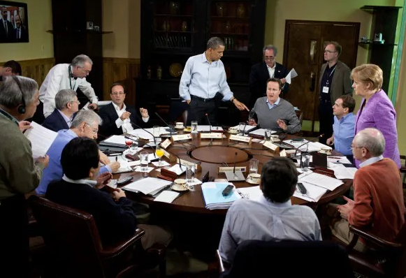
]
]

---

# The Strategy of Trade Negotiations

.pull-left[
- There is a reason the public is not allowed into the "room where it happens"
  - there's a reason *Congress* does is not allowed into the room!
  
- If negotiations were public, or open to Congress:
  - Different interest groups would try to grab their own carve outs and exemptions 

]

.pull-right[
.center[

]
]

---

class: inverse, center, middle

# History of Recent Trade Liberalization

---

# Smoot-Hawley Tariff Act and “Beggar Thy Neighbor”

.center[
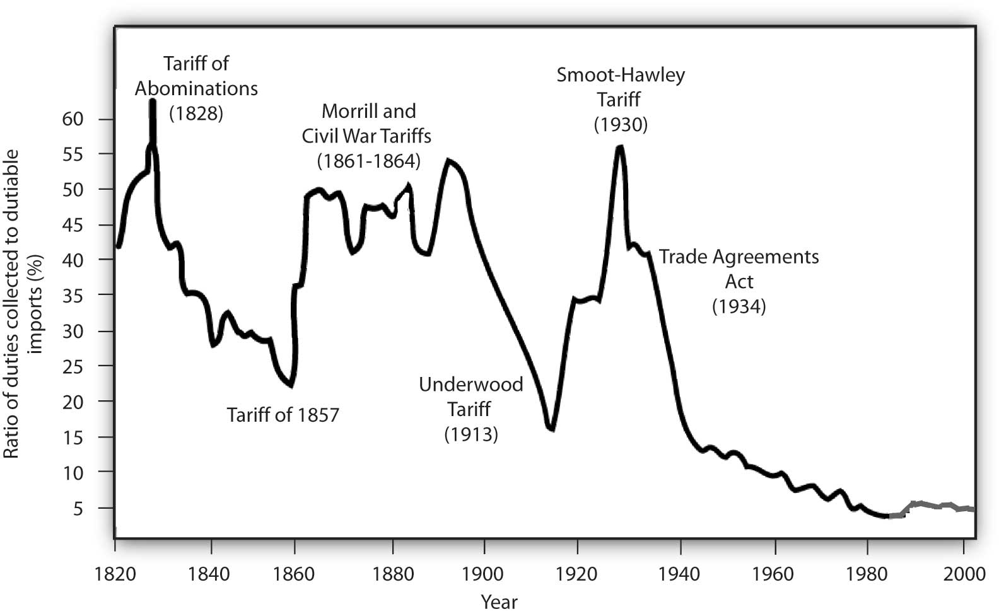
]

---

# Smoot-Hawley Tariff Act and “Beggar Thy Neighbor”

.pull-left[
.center[
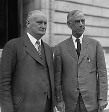

.smallest[
L: Rep. Willis C. Hawley

R: Sen. Reed Smoot
]
]
]


.pull-right[
center[
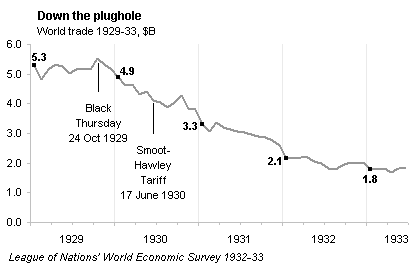
]
]

---

# Smoot-Hawley Tariff Act and “Beggar Thy Neighbor”

.pull-left[
.center[
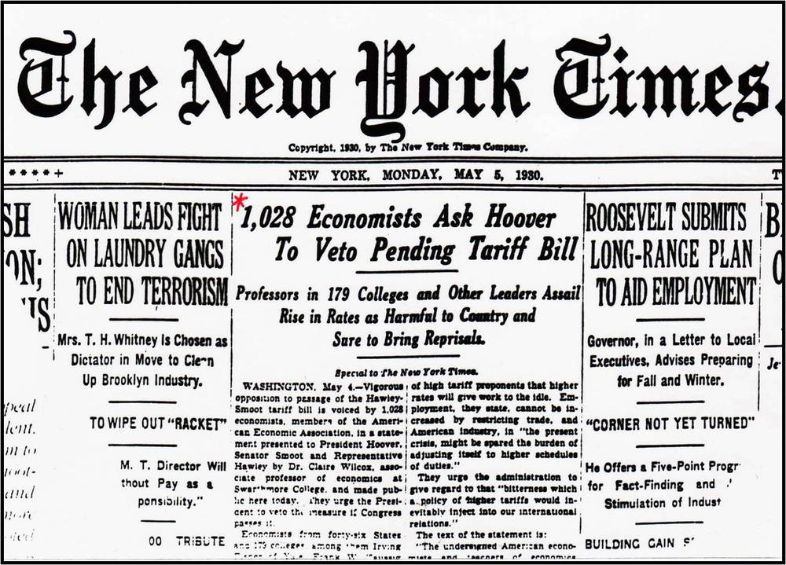
]
]
.pull-right[
.center[
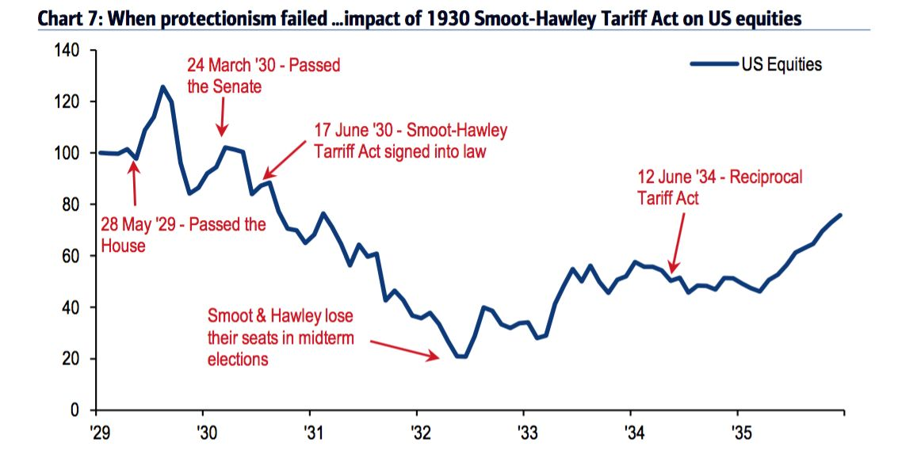
]
]

---

# Most-Favored Nation

.pull-left[
- 1934 Trade Agreements Act

- Authorized the president to negotiate *mutual* tariff reductions with other countries by up to 50% from Smoot-Hawley tariff

- Based on .hi[most favored nation (MFN) principle]: requires a country to provide any concessions, privileges, or immunities granted to *another nation* in a trade agreement also to the U.S. (and vice versa)
  - sounds like favoritism — is actually about equal treatment!
]

.pull-right[
.center[

]
]

---

# GATT

.pull-left[

- 1947 .hi[General Agreement on Tariffs and Trade (GATT)]

- First major multilateral agreement

- Set in motion 9 major “rounds” of negotiations through 2001 
]

.pull-right[
.center[

]
]

---

# GATT

.pull-left[
.smallest[
- 1947 .hi[General Agreement on Tariffs and Trade (GATT)]

- .hi-purple[Principle of nondiscrimination]:
   - .hi-purple[Most Favored Nation] principle again: any better bilateral trade agreement made between two members must also be applied to all GATT members

- .hi-turquoise[“Binding” of tariffs]: countries may lower tariffs, but are not allowed to *raise* tariffs (except in exceptional cases)

- Resolution of trade disputes through GATT institutions

]
]

.pull-right[
.center[

]
]

---

# GATT

.pull-left[

- Protectionist measures in U.S. in 1950s:
  - “Peril-point provisions”
  - “Escape clause”
  - “National security clause”

- 1962 Trade Expansion Act: created Trade Adjustment Assistance (TAA)
]

.pull-right[
.center[

]
]

---

# GATT

.pull-left[

.smallest[
- .hi-purple[“Uruguay Round”] (8th of GATT, 1986-1993, concluded 1994)
  - Tariffs
      - Industrial products fell from 4.7% on average to 3%
      - Share of goods with no tariffs increased from 20-22% to 40-45%
      - Tariffs removed on pharmaceuticals, construction equipment, medical equipment, paper products, steel
]
]

.pull-right[
.center[

]
]

---

# GATT

.pull-left[

.smallest[
- .hi-purple[“Uruguay Round”] (8th of GATT, 1986-1993, concluded 1994)
  - Quotas
      - Quotas on agricultural products to be replaced with less restrictive tariffs by 1999
      - Quotas on textiles to be replaced with less restrictive tariffs by 2004
]
]

.pull-right[
.center[

]
]

---

# GATT

.pull-left[
.smallest[
- .hi-purple[“Uruguay Round”] (8th of GATT, 1986-1993, concluded 1994)
  - Antidumping: Doesn't outright ban countervailing duties, but focuses more on tougher action through GATT institutions
  - Subsidies
      - Volume of subsidized agricultural products to be reduced 21% by 1999
      - Government subsidies for industrial research to be limited to 50% of cost
]
]
.pull-right[
.center[

]
]


---

# GATT

.pull-left[
.smallest[
- .hi-purple[“Uruguay Round”] (8th of GATT, 1986-1993, concluded 1994)
  - Safeguards
      - Countries banned from using health and safety laws not based on scientific research
      - Temporary tariffs allowed to protect domestic industry against temporary import surges
]
]
.pull-right[
.center[

]
]

---

# GATT $\rightarrow$ WTO

.pull-left[

.smallest[
- .hi-purple[“Uruguay Round”] (8th of GATT, 1986-1993, concluded 1994)
  - Intellectual property
      - 20 year protection of patents, trademarks, and copyrights
      - 10 year phase-in period allowed for developing countries' pharmaceuticals

- .hi[World Trade Organization (WTO)]
  - GATT Secretariat is replaced and extended by institutions of the WTO
]
]
.pull-right[
.center[

]
]

---

# WTO

.center[
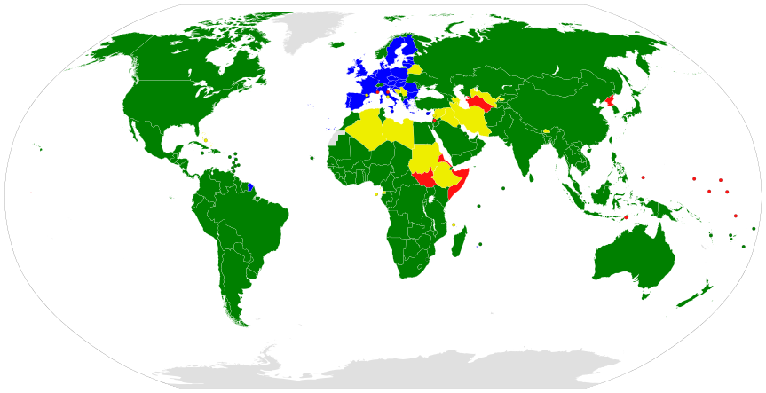

.smallest[
.green[WTO Members], .blue[WTO Members dually represented by EU], .yellow[Observer nations], .red[Non-members]
]

]

---

# WTO

.pull-left[
.smallest[
- WTO principles:
  - Nondiscrimination
  - Reciprocity
  - Binding and enforceable commitments
  - Transparency
  - Safety Valves

- Organization: Councils for Trade in Goods, Trade-Related Aspects of Intellectual Property Rights (TRIPS), Trade in Services, Trade Negotiations Committee

- Dispute Resolution Mechanisms
]
]

.pull-right[
.center[

]
]

---

# WTO

.pull-left[

- Estimated that Uruguay Round:
  - increased the volume of world trade by 20% (25% from manufacturing, 75% from agriculture)
  - increased world income gains by $349 billion ($164 billion from agriculture, $130 billion from manufacturing, $55 billion from services)
  - developing countries receiving 42% of the gains - double their share of world GDP

.source[Salvatore, Domenick, 2001, *International Eocnomics*, 164]
]

.pull-right[
.center[

]
]

---

# WTO

.pull-left[

- 2001 China admitted to WTO

- 2002 Congress granted President “fast-track authority” to negotiate trade deals, expired in 2007
  
]

.pull-right[
.center[

]
]

---

# WTO

.pull-left[

- Doha Round (9th of GATT, 2001-?, failed so far)

- Disagreements over agricultural subsidies

- Debates about GMOs, health and safety issues, environmental protection
]

.pull-right[
.center[

]
]

---

class: inverse, center, middle

# The Economic Effects of Trade Agreements

---

# Trade Creation & Trade Diversion

.pull-left[

- Consider the market for T-shirts in the United States
]

.pull-right[
```{r}
Demand=function(x){20-x}
Supply=function(x){x}

p<-ggplot(data.frame(x=c(0,12)), aes(x=x))+
  stat_function(fun=Demand, geom="line", color="blue", size=2)+
  geom_label(x=3,y=Demand(3), color = "blue", label="Demand (Domestic)")+
  stat_function(fun=Supply, geom="line", color="red", size=2)+
  geom_label(x=17,y=Supply(17), color = "red", label="Supply (Domestic)")+
  #geom_segment(x = 0, y = 10, xend=10, yend=10, linetype="dotted", size=1)+
  #geom_segment(x = 10, y = 10, xend=10, yend=0, linetype="dotted", size=1)+
  labs(x = "Quantity (Billions)",
       y = "Price")+
  scale_x_continuous(breaks=seq(0,20,2),
                     limits=c(0,22),
                     expand=c(0,0))+
  scale_y_continuous(breaks=seq(0,20,2),
                     labels = scales::dollar,
                     limits=c(0,22),
                     expand=c(0,0))+
  ggthemes::theme_pander(base_family = "Fira Sans Condensed", base_size=18)
p
```
]

---

# Trade Creation & Trade Diversion

.pull-left[

- Suppose the United States can import T-shirts from .pink[Japan]
]

.pull-right[
```{r}
p+geom_hline(yintercept=3, size = 2, color = "#e64173")+
  geom_label(x=18,y=3, label="Supply (Japan)", color = "#e64173", size = 3)
```
]

---

# Trade Creation & Trade Diversion

.pull-left[

- Suppose the United States can import T-shirts from .pink[Japan] or .purple[Mexico]
  - .pink[Japan] is more efficient ($3/shirt) than .purple[Mexico] ($4/shirt)
]

.pull-right[
```{r}
p+geom_hline(yintercept=3, size = 2, color = "#e64173")+
  geom_label(x=18,y=3, label="Supply (Japan)", color = "#e64173", size = 3)+
  geom_hline(yintercept=4, size = 2, color = "#6A5ACD")+
  geom_label(x=18,y=4, label="Supply (Mexico)", color = "#6A5ACD", size = 3)
```
]

---

# Trade Creation & Trade Diversion

.pull-left[

- Suppose the United States can import T-shirts from .pink[Japan] or .purple[Mexico]
  - .pink[Japan] is more efficient ($3/shirt) than .purple[Mexico] ($4/shirt)

- Under free trade, U.S. would import 14 Bn from .pink[Japan] (cheapest), and 0 from .purple[Mexico]
]

.pull-right[
```{r}
p+geom_hline(yintercept=3, size = 2, color = "#e64173")+
  geom_label(x=18,y=3, label="Supply (Japan)", color = "#e64173", size = 3)+
  geom_hline(yintercept=4, size = 2, color = "#6A5ACD", alpha = 0.25)+
  geom_label(x=18,y=4, label="Supply (Mexico)", color = "#6A5ACD", size = 3)+
  geom_segment(x=3,y=0, xend=3, yend=3, size = 1, linetype = "dotted")+
  geom_segment(x=17,y=0, xend=17, yend=3, size = 1, linetype = "dotted")+
  annotate("segment", x = 3, xend = 17, y = 2, yend = 2, color = "black", size=2, alpha=1, arrow=arrow(length=unit(0.5,"cm"), ends="both", type="closed"))+
  geom_label(x = 10, y = 2, color = "black", label = "Imports")
```
]

---

# Trade Creation & Trade Diversion

.pull-left[

- Suppose the United States can import T-shirts from .pink[Japan] or .purple[Mexico]
  - .pink[Japan] is more efficient ($3/shirt) than .purple[Mexico] ($4/shirt)

- Suppose instead the U.S. has a 100% tariff on *any/all* imported T-shirts
  - .pink[Japanese] imports are still cheapest (but at $6/shirt now, vs. $8 .purple[Mexican] shirts)
  - Imports 8 Bn from .pink[Japan] and 0 Bn from .purple[Mexico]
]

.pull-right[
```{r}
p+geom_hline(yintercept=3, size = 2, color = "#e64173", alpha =0.25)+
  geom_label(x=18,y=3, label="Supply (Japan)", color = "#e64173", size = 3)+
  geom_hline(yintercept=4, size = 2, color = "#6A5ACD", alpha = 0.25)+
  geom_label(x=18,y=4, label="Supply (Mexico)", color = "#6A5ACD", size = 3)+
  
  geom_hline(yintercept=6, size = 2, color = "#e64173", alpha =1.0)+
  geom_label(x=18,y=6, label="Supply (Japan) + t", color = "#e64173", size = 3, alpha=1.0)+
  geom_hline(yintercept=8, size = 2, color = "#6A5ACD", alpha = 1.0)+
  geom_label(x=18,y=8, label="Supply (Mexico) + t", color = "#6A5ACD", size = 3, alpha = 1.0)+
  
  geom_segment(x=6,y=0, xend=6, yend=6, size = 1, linetype = "dotted")+
  geom_segment(x=14,y=0, xend=14, yend=6, size = 1, linetype = "dotted")+
  annotate("segment", x = 6, xend = 14, y = 2, yend = 2, color = "black", size=2, alpha=1, arrow=arrow(length=unit(0.5,"cm"), ends="both", type="closed"))+
  geom_label(x = 10, y = 2, color = "black", label = "Imports")
```
]

---

# Trade Creation & Trade Diversion

.pull-left[

- Now suppose the U.S. and .purple[Mexico] enter a free trade agreement
  - U.S. drops tariffs on .purple[Mexico] to 0%
  - Keeps tariff on .pink[Japan]

- Now .purple[Mexican] T-shirts (with no tariff) are cheaper at $4/shirt compared with .pink[Japan] (still with tariff) at $6/shirt!
  - U.S. imports 12 Bn from .purple[Mexico], imports 0 Bn from .pink[Japan]
]

.pull-right[
```{r}
p+geom_hline(yintercept=3, size = 2, color = "#e64173", alpha =0.25)+
  geom_label(x=18,y=3, label="Supply (Japan)", color = "#e64173", size = 3)+
  geom_hline(yintercept=4, size = 2, color = "#6A5ACD", alpha = 1.0)+
  geom_label(x=18,y=4, label="Supply (Mexico)", color = "#6A5ACD", size = 3, alpha = 1.0)+
  
  geom_hline(yintercept=6, size = 2, color = "#e64173", alpha =1.0)+
  geom_label(x=18,y=6, label="Supply (Japan) + t", color = "#e64173", size = 3, alpha=1.0)+
  geom_hline(yintercept=8, size = 2, color = "#6A5ACD", alpha = 0.25)+
  geom_label(x=18,y=8, label="Supply (Mexico) + t", color = "#6A5ACD", size = 3)+
  
  geom_segment(x=4,y=0, xend=4, yend=4, size = 1, linetype = "dotted")+
  geom_segment(x=16,y=0, xend=16, yend=4, size = 1, linetype = "dotted")+
  annotate("segment", x = 4, xend = 16, y = 2, yend = 2, color = "black", size=2, alpha=1, arrow=arrow(length=unit(0.5,"cm"), ends="both", type="closed"))+
  geom_label(x = 10, y = 2, color = "black", label = "Imports")
```
]

---

# Trade Creation & Trade Diversion

.pull-left[

- **Effects from the free trade agreement** (with .purple[Mexico]):

1. .hi-turquoise[Trade creation]: U.S. imports more T-shirts (compared to under *equal* tariffs), all from .purple[Mexico]

2. .hi-turquoise[Trade diversion]: .pink[Japan] is actually a more efficient producer than .purple[Mexico] (if no tariffs), but U.S. only trades with .purple[Mexico] because .hi[Japan] is outside free trade zone
  - U.S. trade diverted from .pink[Japan] to .purple[Mexico]
  
]

.pull-right[
```{r}
p+geom_hline(yintercept=3, size = 2, color = "#e64173", alpha =0.25)+
  geom_label(x=18,y=3, label="Supply (Japan)", color = "#e64173", size = 3)+
  geom_hline(yintercept=4, size = 2, color = "#6A5ACD", alpha = 1.0)+
  geom_label(x=18,y=4, label="Supply (Mexico)", color = "#6A5ACD", size = 3, alpha = 1.0)+
  
  geom_hline(yintercept=6, size = 2, color = "#e64173", alpha =1.0)+
  geom_label(x=18,y=6, label="Supply (Japan) + t", color = "#e64173", size = 3, alpha=1.0)+
  geom_hline(yintercept=8, size = 2, color = "#6A5ACD", alpha = 0.25)+
  geom_label(x=18,y=8, label="Supply (Mexico) + t", color = "#6A5ACD", size = 3)+
  
  geom_segment(x=4,y=0, xend=4, yend=4, size = 1, linetype = "dotted")+
  geom_segment(x=16,y=0, xend=16, yend=4, size = 1, linetype = "dotted")+
  annotate("segment", x = 4, xend = 16, y = 2, yend = 2, color = "black", size=2, alpha=1, arrow=arrow(length=unit(0.5,"cm"), ends="both", type="closed"))+
  geom_label(x = 10, y = 2, color = "black", label = "Imports")
```
]

---

# Dynamic Benefits of Free Trade Agreements

.pull-left[
- Increase competition, limit domestic monopoly power

- Access to larger markets creates economies of scale

- More investment by outside countries to FTA-member countries (to take advantage of larger market) and avoid tariffs
  - .hi-purple[“tariff factories”]: Foreign firms from non-FTA-member countries set up shop *inside* countries with agreement to avoid import tariffs
]

.pull-right[
.center[

]
]

---

# NAFTA 

.pull-left[
- .hi[North American Free Trade Agreement (NAFTA)] between U.S., Canada, and Mexico since 1994

- U.S. had a free trade agreement with Canada since 1988/9, wanted to bring Mexico into the fold

- 2018: rebranded as .hi[U.S.-Mexcio-Canada Agreement (USMCA)]
]

.pull-right[
.center[

]
]

---

# NAFTA

.center[
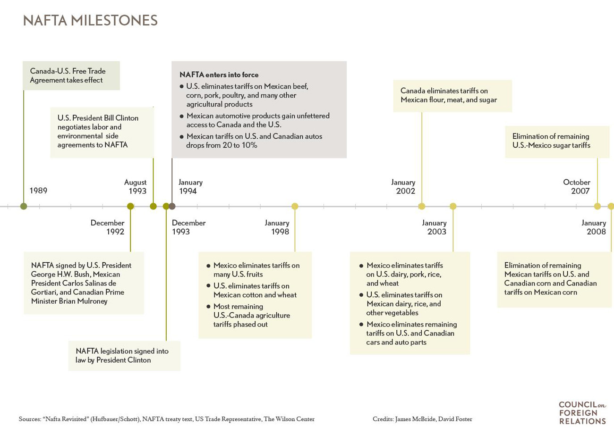
]

---

# Trade Creation & Trade Diversion: NAFTA

.pull-left[
.center[
Cost of Importing an Automobile to the U.S.
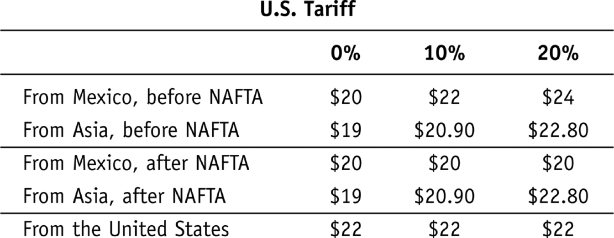
]
]

---

# Effects of NAFTA

.pull-left[
- Tripled trade between U.S., Mexico, and Canada
  - $290 billion in 1993 $\rightarrow$ $1.1 trillion in 2016

- U.S. foreign investment in Mexico increased from $15 billion to $100 billion
]

.pull-right[
.center[

]
]

---

# Maquiladoras

.pull-left[
.smallest[
- .hi-purple[Maquiladora]: factories in Mexico that import goods from U.S. or abroad, manufacture output, and then export to the U.S. (or elsewhere)
  - Often located near the border with U.S.

- Lower wages and lower tariffs

- Before NAFTA: 47% maquila employment growth (564 new plants)
- After NAFTA: 86% over next five years (1460 new plants)
]
]

.pull-right[
.center[
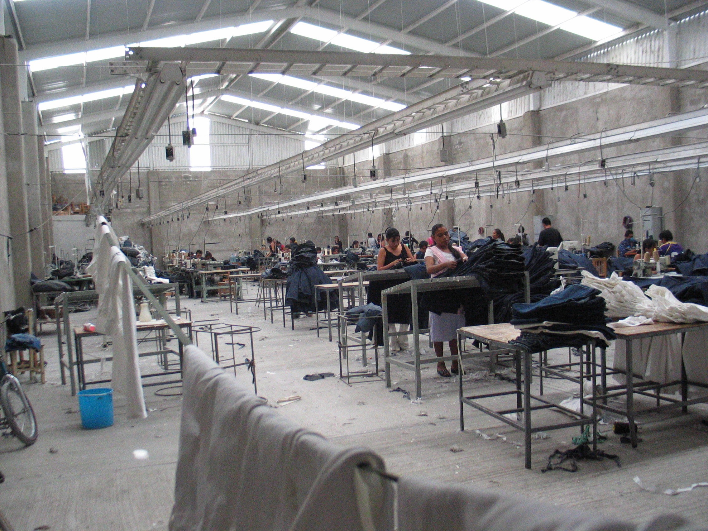
]
]

---

# Effects of NAFTA

.pull-left[
.quitesmall[
- Effects on U.S.: modest, increased GDP by 0.5%, or $80 billion

- Concentrated costs (U.S. manufacturing & automobiles) but dispersed benefits to consumers

- Est. 14 million jobs depend on trade with Canada and Mexico, 200,000 export related jobs created annually, paying 15-20% more on average than jobs lost to NAFTA

- Companies moving many factories to Mexico, U.S. auto sector lost 350,000 jobs since 1994; Mexican auto sector increased from 120,000 to 500,000 jobs

- Est. 15,000 net jobs lost each year but economy gains $450,000 in higher productivity gains and lower consumer prices
]

.source[[Source: Council on Foreign Relations](http://www.cfr.org/trade/naftas-economic-impact/p15790)]
]

.pull-right[
.center[

]
]
