```{r setup, include=FALSE}
options(htmltools.dir.version = FALSE)
knitr::opts_chunk$set(echo=F,
                      message=F,
                      warning=F,
                      fig.retina=3,
                      fig.align="center")
library(tidyverse)
library(ggrepel)
library(mosaic)
set.seed(256)
update_geom_defaults("label", list(family = "Fira Sans Condensed"))
theme_slides<-ggthemes::theme_pander(base_family="Fira Sans Condensed", base_size = 14)

```

# Diseases of Poverty vs. Diseases of Affluence

.pull-left[
.smallest[
- Humans will always have to contend with disease

- But as many societies have developed, we have made a tradeoff between:

- .hi[“Diseases of poverty”]: 
  - malnutrition, poor hygiene, crowded & unsanitary living conditions, unclean water
  - often infectious diseases that spread easily
  - .hi-green[Examples]: dysentery, cholera, smallpox, tuberculosis

- Historically, this has killed the overwhelming majority of humanity, primarily children
]
]

.pull-right[
.center[

]
]

---

# Diseases of Poverty vs. Diseases of Affluence

.pull-left[
.smallest[
- Humans will always have to contend with disease

- .hi[“Diseases of affluence”]:
  - caused by excess in diet, sedentary lifestyle
  - .hi-green[Examples]: diabetes, heart disease, cancers

- Wealthier countries have largely reduced or eradicated diseases of poverty, more death caused by diseases of civilization
]
]
.pull-right[
.center[

]
]

---

# Civilization Causes Disease Too

.left-column[
.center[

]
]

.right-column[

.smallest[
> “For most of our history we supported ourselves by hunting and gathering: we hunted wild animals and foraged for wild plants. It's a life that philosophers have traditionally regarded as nasty, brutish, and short. Since no food is grown and little is stored, there is (in this view) no respite from the struggle that starts anew each day to find wild foods and avoid starving...[The question] ‘Why did almost all our hunter-gatherer ancestors adopt agriculture?’ is silly. Of course they adopted it because agriculture is an efficient way to get more food for less work. Planted crops yield far more tons per acre than roots and berries.”

]

.source[Diamond, Jared, 1999, [“The Worst Mistake in the History of the Human Race”](https://www.discovermagazine.com/planet-earth/the-worst-mistake-in-the-history-of-the-human-race), *Discover Magazine*]
]

---

# Civilization Causes Disease Too

.left-column[
.center[

]
]

.right-column[

.smallest[
> “For most of our history we supported ourselves by hunting and gathering: we hunted wild animals and foraged for wild plants. It's a life that philosophers have traditionally regarded as nasty, brutish, and short. Since no food is grown and little is stored, there is (in this view) no respite from the struggle that starts anew each day to find wild foods and avoid starving...[The question] ‘Why did almost all our hunter-gatherer ancestors adopt agriculture?’ is silly. Of course they adopted it because agriculture is an efficient way to get more food for less work. Planted crops yield far more tons per acre than roots and berries.”

]

.source[Diamond, Jared, 1999, [“The Worst Mistake in the History of the Human Race”](https://www.discovermagazine.com/planet-earth/the-worst-mistake-in-the-history-of-the-human-race), *Discover Magazine*]
]

---

# Civilization Causes Disease Too

.pull-left[
.center[

]
]

.pull-right[

.tiny[
> “There are at least three sets of reasons to explain the findings that agriculture was bad for health. First, hunter-gatherers enjoyed a varied diet, while early farmers obtained most of their food from one or a few starchy crops. The farmers gained cheap calories at the cost of poor nutrition, (today just three high-carbohydrate plants — wheat, rice, and corn — provide the bulk of the calories consumed by the human species, yet each one is deficient in certain vitamins or amino acids essential to life.) Second, because of dependence on a limited number of crops, farmers ran the risk of starvation if one crop failed. Finally, the mere fact that agriculture encouraged people to clump together in crowded societies, many of which then carried on trade with other crowded societies, led to the spread of parasites and infectious disease. (Some archaeologists think it was the crowding, rather than agriculture, that promoted disease, but this is a chicken-and-egg argument, because crowding encourages agriculture and vice versa.) Epidemics couldn't take hold when populations were scattered in small bands that constantly shifted camp. Tuberculosis and diarrheal disease had to await the rise of farming, measles and bubonic plague the appearance of large cities."

]

.source[Diamond, Jared, 1999, [“The Worst Mistake in the History of the Human Race”](https://www.discovermagazine.com/planet-earth/the-worst-mistake-in-the-history-of-the-human-race), *Discover Magazine*]

]

---

# Civilization Causes Disease Too

.pull-left[

- Really we should say the first type of diseases are diseases of *Post-Neolithic* poverty
  - Crowded cities, towns, and farms

- Most modern infectious diseases came from animals
  - Farming increased proximity to domesticated cattle, pigs, etc.

.source[Diamond, Jared, 1999, *Guns, Germs, and Steel: The Fates of Human Societies*]

]

.pull-right[
.center[


Diamond (1999: 207)
]
]

---

# Disease Has Spread With Conquest

.center[


]

.smallest[
- Francisco Pizarro conquered the 10,000,000 person Incan Empire with 168 men and a few guns and horses
]

--

.smallest[
- In 1520, it took one sick person to bring smallpox to South America, where it may have killed **90% of the population**
]

---

# Disease Has Spread With Conquest

.pull-left[

- Europeans lived in extremely close proximity to their domesticated animals

- Repeatedly decimated by these diseases

- Evolved some immunity to them, relative to indigenous peoples in the Americas, prior to European colonization

]

.pull-right[
.center[

]
]

---

# Disease Has Spread With Conquest

.left-column[
.center[


.smallest[
John Winthrop

(1587-1649)

3rd Governor of Massachussetts Bay Colony
]
]
]
.right-column[

> "But for the natives in these parts, God hath so pursued them, as for 300 miles space the greatest part of them are swept away by the smallpox which still continues among them. So as God hath thereby cleared our title to this place, those who remain in these parts, being in all not 50, have put themselves under our protection."

]

---

# Disease Has Spread With Conquest

.left-column[
.center[


James I, King of England

(1566-1625)

]
]

.right-column[

> "Almighty God in his great goodness and bounty towards us [for sending] this wonderful plague among the savages."

]

---

# Disease Has Spread With Trade as Well

.pull-left[
.center[
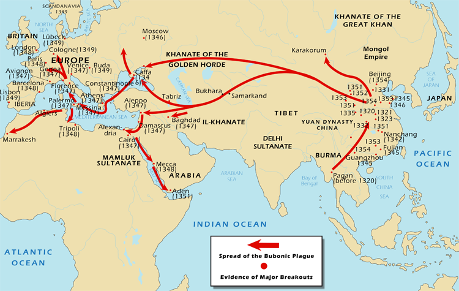
]
]

.pull-right[
.center[
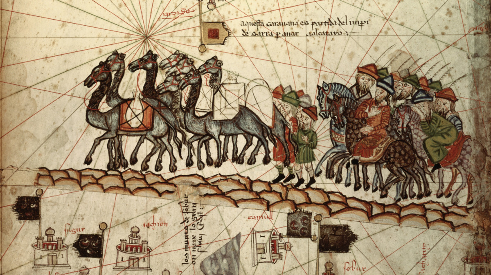
]

]

.tiny[
> “It killed off many of the Mongol rulers and other elite, and weakened the army as well as the local economies,” explains Christopher I. Beckwith, a distinguished professor at Indiana University Bloomington, and author of the 2011 book Empires of the Silk Road. It’s estimated that the Black Death killed 25 million people in Asia and North Africa between 1347 and 1350, in addition to the carnage in Europe.”

Source: [History.com “How the Black Death Spread Along the Silk Road”](https://www.history.com/news/silk-road-black-death)
]

---

# Disease Has Spread With Trade as Well

.pull-left[
.center[
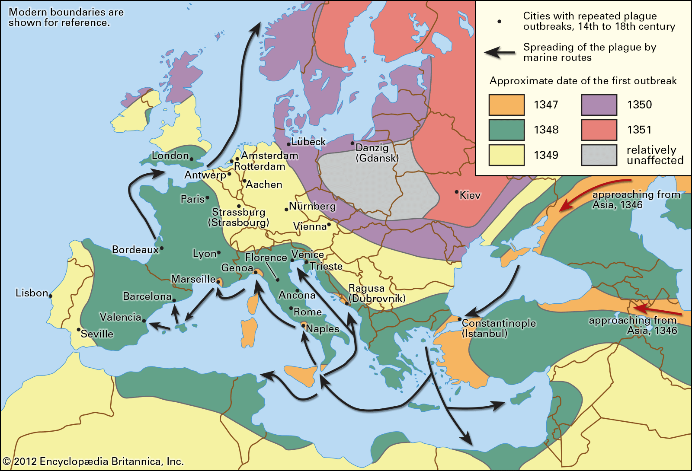
]
]

.pull-right[

- Bubonic plague ravages Europe (esp. 1340s-1350s)

- 75-200 million die (30-60% of European population)
]

---

# Global Causes of Death

<iframe src="https://ourworldindata.org/grapher/annual-number-of-deaths-by-cause" loading="lazy" style="width: 100%; height: 550px; border: 0px none;"></iframe>
# Global Disease Burden


---

# Disease Burden

<iframe src="https://ourworldindata.org/grapher/burden-of-disease-by-cause?time=2017..latest" loading="lazy" style="width: 100%; height: 550px; border: 0px none;"></iframe>


---

# Fewer Communicable Diseases

<iframe src="https://ourworldindata.org/grapher/total-number-of-deaths-by-cause?stackMode=relative" loading="lazy" style="width: 100%; height: 550px; border: 0px none;"></iframe>

---

# Death in Children

<iframe src="https://ourworldindata.org/grapher/causes-of-death-in-children-under-5" loading="lazy" style="width: 100%; height: 550px; border: 0px none;"></iframe>

---

# Mortality Rates in Children Have Plummeted

.center[
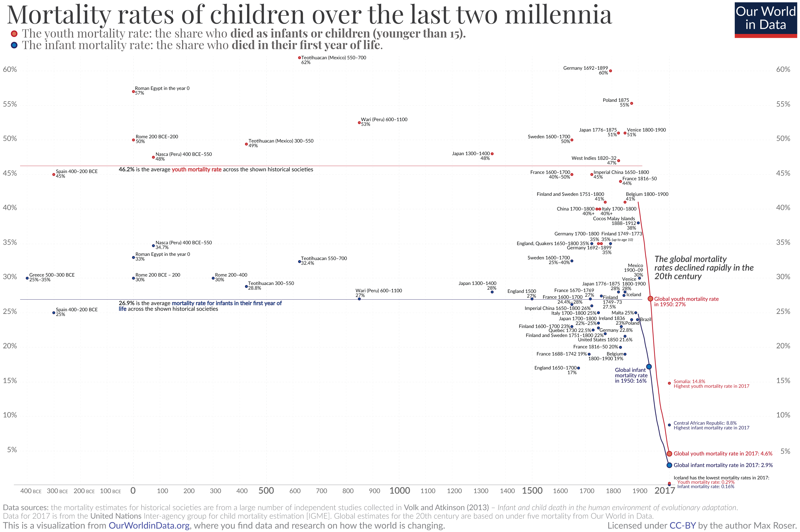
]

---

# Reflections of Risk

.center[

]

---

# Diseases of Poverty...

<iframe src="https://ourworldindata.org/grapher/burden-of-disease-rates-from-communicable-neonatal-maternal-nutritional-diseases?time=2017" loading="lazy" style="width: 100%; height: 550px; border: 0px none;"></iframe>

---

# ...Have Been Decreasing

<iframe src="https://ourworldindata.org/grapher/disease-burden-from-communicable-diseases" loading="lazy" style="width: 100%; height: 550px; border: 0px none;"></iframe>

---

# ...Primarily Among Children


<iframe src="https://ourworldindata.org/grapher/disease-burden-from-communicable-diseases-by-age?stackMode=relative" loading="lazy" style="width: 100%; height: 550px; border: 0px none;"></iframe>

---

# Wealth and Disease

.center[
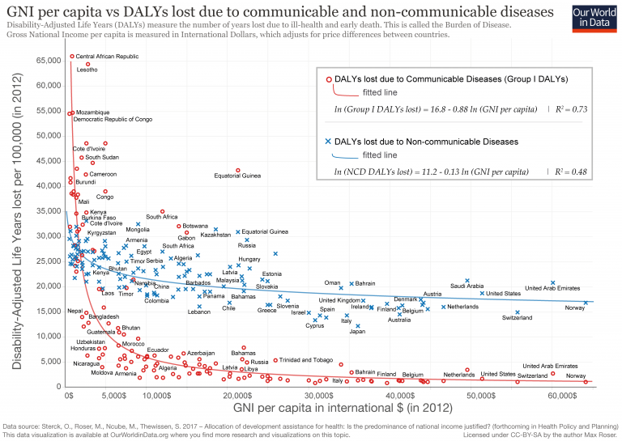
]

---
# Wealth and Disease


<iframe src="https://ourworldindata.org/grapher/disease-burden-to-communicable-diseases-vs-gdp?time=2017..latest" loading="lazy" style="width: 100%; height: 550px; border: 0px none;"></iframe>

---

# Smallpox

.left-column[
.center[

]
]

.right-column[

.quitesmall[
> “In 18th-century Europe, it is estimated that 400,000 people died from the disease per year, and that one-third of all cases of blindness were due to smallpox. Smallpox is estimated to have killed up to 300 million people in the 20th century and around 500 million people in the last 100 years of its existence, as well as six monarchs. As recently as 1967, 15 million cases occurred a year.

> “Inoculation for smallpox appears to have started in China around the 1500s. Europe adopted this practice from Asia in the first half of the 18th century. In 1796 Edward Jenner introduced the modern smallpox vaccine. In 1967, the WHO intensified efforts to eliminate the disease. Smallpox is one of two infectious diseases to have been eradicated, the other being rinderpest in 2011. The term "smallpox" was first used in Britain in the early 16th century to distinguish the disease from syphilis, which was then known as the "great pox". Other historical names for the disease include pox, speckled monster, and red plague.
 
Source: [Wikipedia](https://en.wikipedia.org/wiki/Smallpox)

]
]

---

# Smallpox Incidence

<iframe src="https://ourworldindata.org/grapher/number-of-reported-smallpox-cases?time=1977" loading="lazy" style="width: 100%; height: 550px; border: 0px none;"></iframe>

---

# Smallpox Has Almost Disappeared

<iframe src="https://ourworldindata.org/grapher/decade-in-which-smallpox-ceased-to-be-endemic-by-country" loading="lazy" style="width: 100%; height: 550px; border: 0px none;"></iframe>

---

# The Pox of Liberty

.pull-left[
.center[

]
]

.pull-right[
.center[
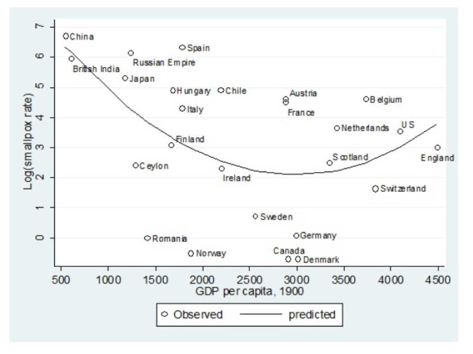
]
]

---

# 1918 Spanish Influenza

.pull-left[
.center[

]
]

.pull-right[
.center[
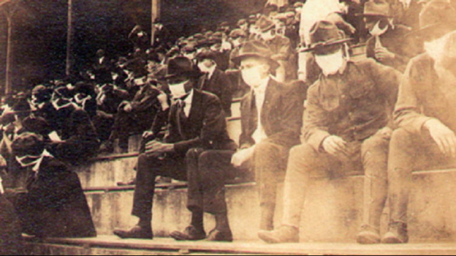
]

]

.tiny[

> “Lasting from February 1918 to April 1920, it infected 500 million people – about a third of the world's population at the time – in four successive waves. The death toll is typically estimated to have been somewhere between 17 million and 50 million, and possibly as high as 100 million, making it one of the deadliest pandemics in human history” - [Wikipedia](https://en.wikipedia.org/wiki/Spanish_flu)

]
---

# 1918 Spanish Influenza

.pull-left[
.center[
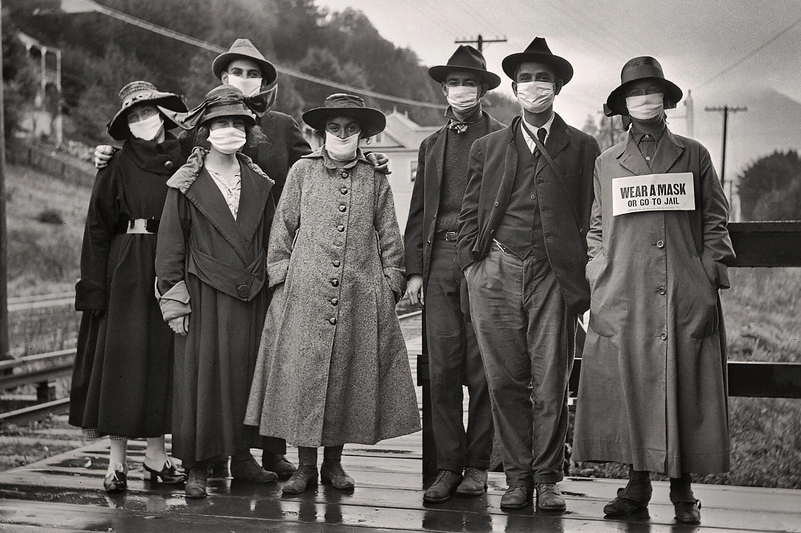
]
]

.pull-right[
.center[
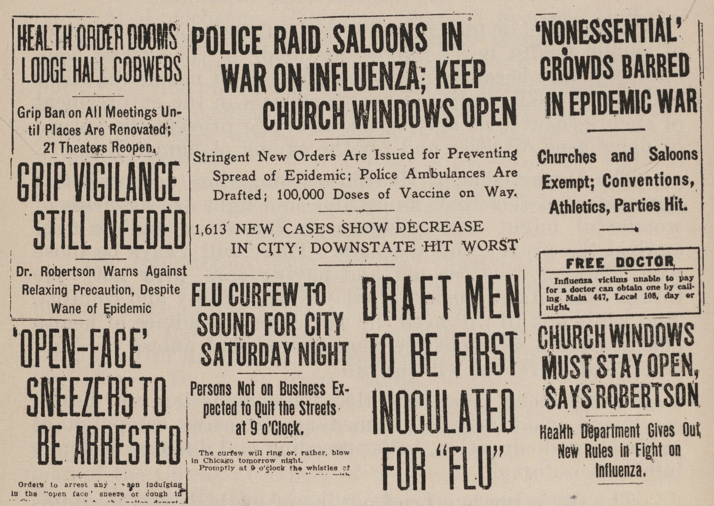
]

]

.source[Source: [NY Times: The Mask Slackers of 1918](https://www.nytimes.com/2020/08/03/us/mask-protests-1918.html?utm_source=pocket-newtab)]


---

# 1918 Spanish Influenza

.center[

]


.source[Source: [NY Times: The Mask Slackers of 1918](https://www.nytimes.com/2020/08/03/us/mask-protests-1918.html?utm_source=pocket-newtab)]

---

# Variation in Interventions

.center[
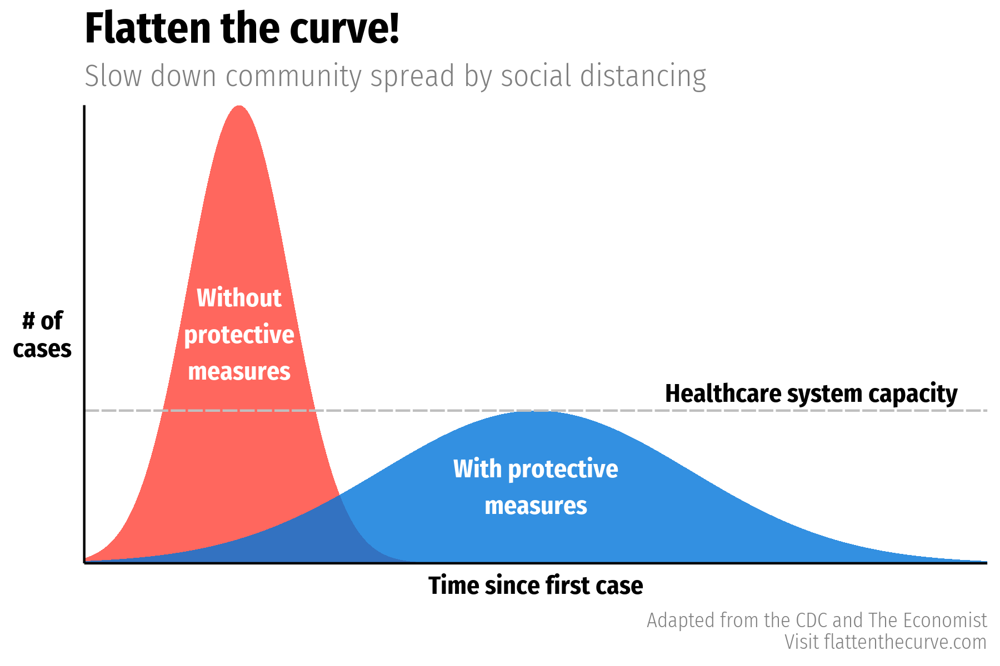
]

---

# Variation in Interventions

.pull-left[
.center[
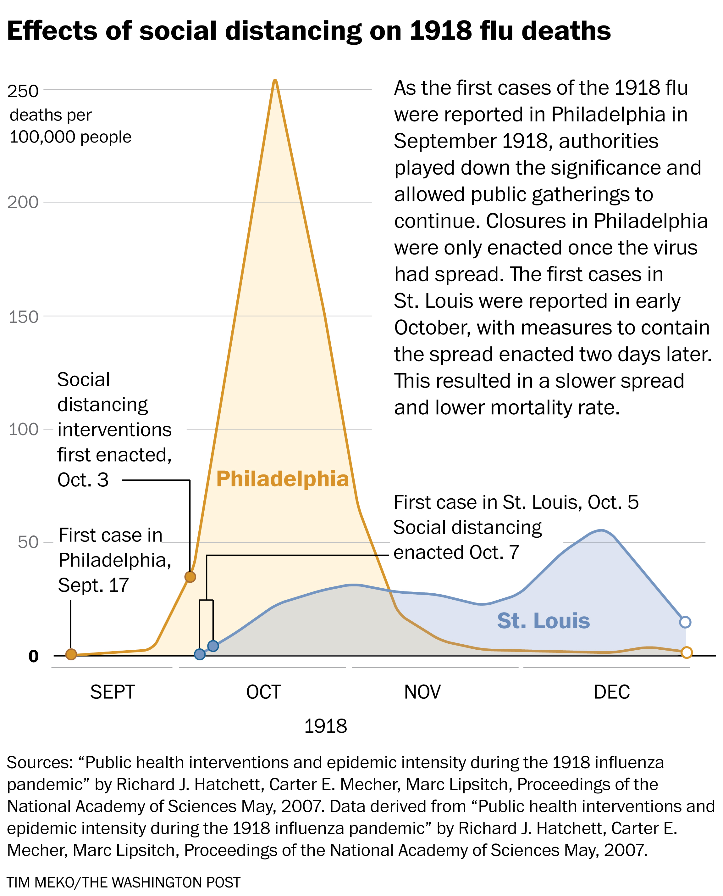
]
]

.pull-right[
.center[

]
]

.source[
Sources: [Washington Post](https://www.washingtonpost.com/health/2020/03/10/social-distancing-coronavirus/)

Hatchett, Carter, and Lipsitch, 2007, ["Public health interventions and epidemic intensity during the 1918 influenza pandemic"](https://www.pnas.org/content/104/18/7582) *PNAS* 104(18)
]
---

# Trade Restrictions

.pull-left[

- Pandemics of infectious diseases are a good argument for trade restrictions

- Customs & Border Protection already restricts entry with foreign plants & animals that are invasive species or can introduce new diseases to domestic plants & animals

]

.pull-right[
.center[
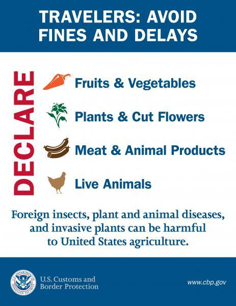
]
]


---

# Trade Restrictions

.pull-left[

- Pandemics of infectious diseases are a good argument for trade restrictions

- With an airborne/respiratory virus: better to limit people than goods

- With a virus spread by *fomites*: better argument to restrict movement of goods too

]

.pull-right[
.center[

]
]

---

# Travel Restrictions in the Covid Pandemic

<iframe src="https://ourworldindata.org/grapher/international-travel-covid?time=2020-11-16" loading="lazy" style="width: 100%; height: 550px; border: 0px none;"></iframe>

---

# Government Responsess in the Covid Pandemic

<iframe src="https://ourworldindata.org/grapher/covid-stringency-index?time=2020-11-16" loading="lazy" style="width: 100%; height: 550px; border: 0px none;"></iframe>

---

# Policy Interventions?

.center[

]

---

# Policy Interventions?

.smallest[
> “Pandemics Depress the Economy, Public Health Interventions Do Not: Evidence from the 1918 Flu”

> “What are the economic consequences of an influenza pandemic? And given the pandemic, what are the economic costs and benefits of non-pharmaceutical interventions (NPI)? Using geographic variation in mortality during the 1918 Flu Pandemic in the U.S., we find that more exposed areas experience a sharp and persistent decline in economic activity. The estimates imply that the pandemic reduced manufacturing output by 18%. The downturn is driven by both supply and demand-side channels. Further, building on findings from the epidemiology literature establishing that NPIs decrease influenza mortality, we use variation in the timing and intensity of NPIs across U.S. cities to study their economic effects. We find that cities that intervened earlier and more aggressively do not perform worse and, if anything, grow faster after the pandemic is over. Our findings thus indicate that NPIs not only lower mortality; they also mitigate the adverse economic consequences of a pandemic.”

]

.source[Correia, Sergio, Stephan Luck, and Emil Verner, 2020, [“Pandemics Depress the Economy, Public Health Interventions Do Not: Evidence from the 1918 Flu”](https://papers.ssrn.com/sol3/papers.cfm?abstract_id=3561560)]

---

# Remember: It's Always Worse for Others

.center[

]